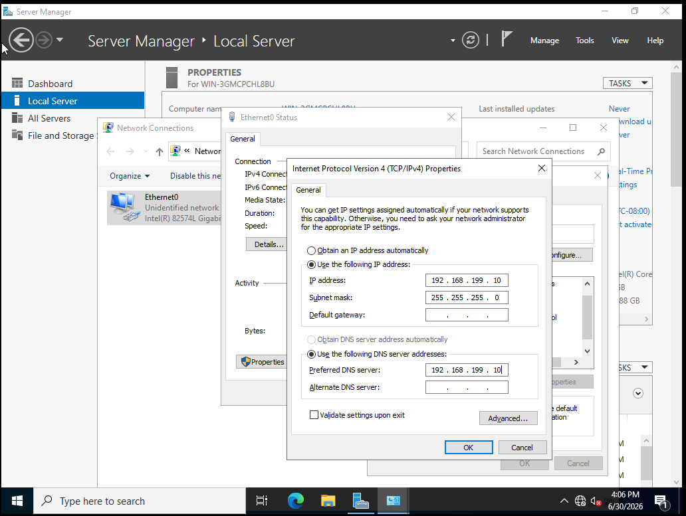
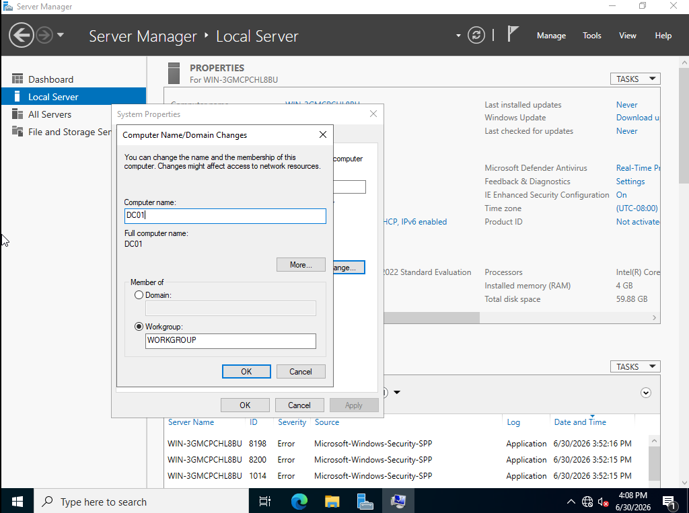
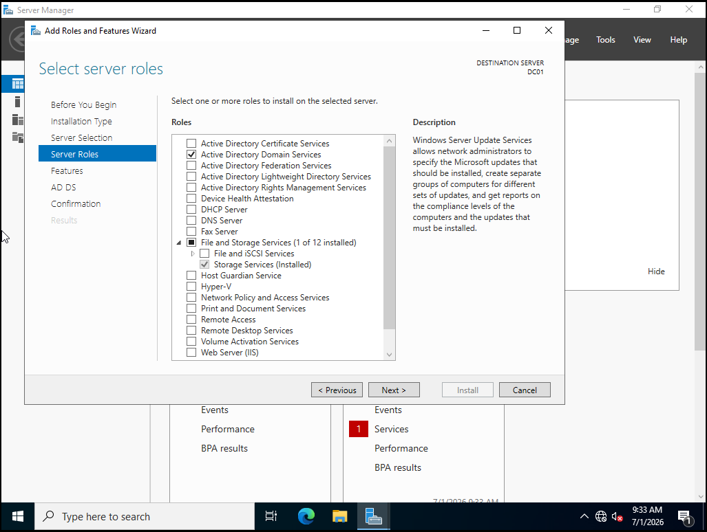
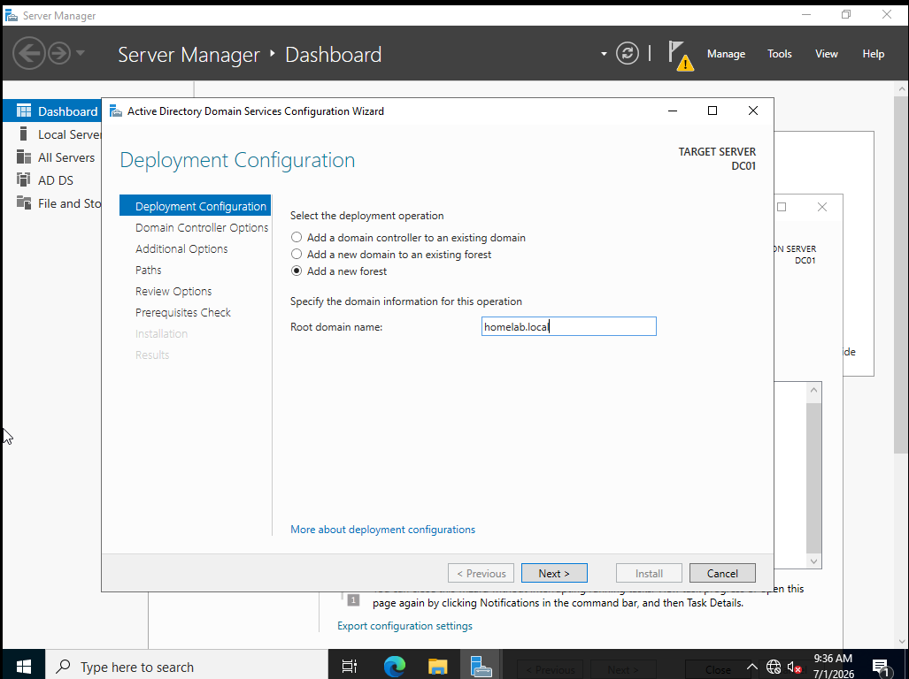
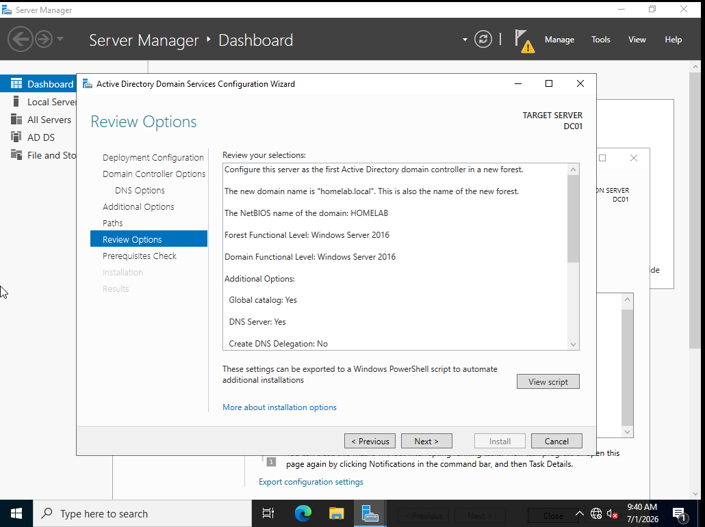
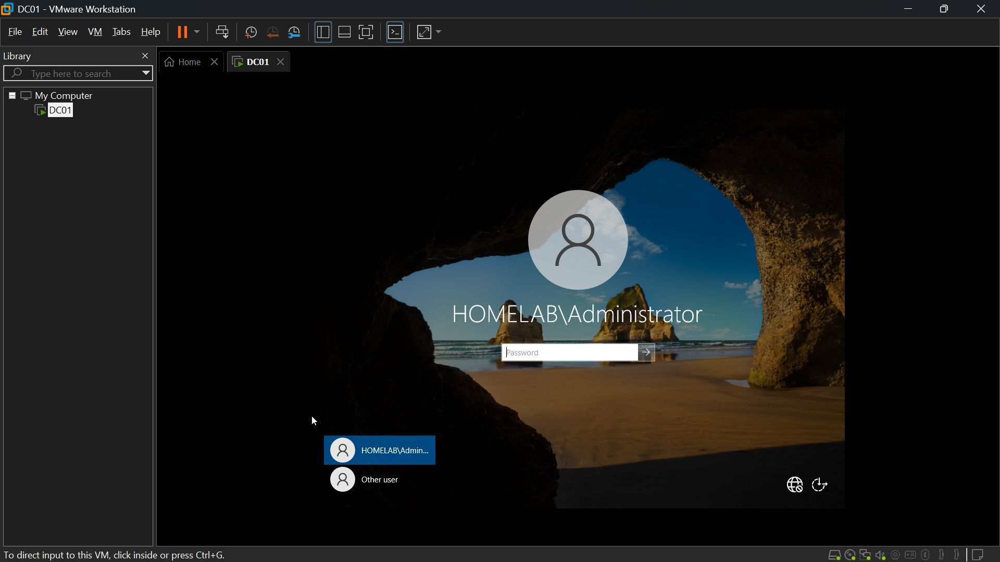
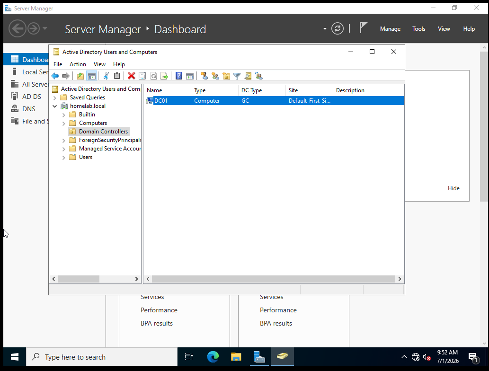

# DC01 — Active Directory Domain Services Setup

**Role:** promoting the company's main server to a domain controller
**Date:** June 30, 2026

## Summary
Configured DC01 with a static IP and hostname, then installed and promoted
Active Directory Domain Services (AD DS), creating a new forest and domain
(`homelab.local`). DC01 now acts as the company's central identity and DNS
authority — every future machine on the network will join this domain rather
than existing as a standalone system.

## Stage 1 — Static IP and Hostname
- Confirmed the lab's actual VMnet1 subnet (192.168.199.0/24) via VMware's
  Virtual Network Editor before assigning an address, to avoid conflicting
  with the DHCP pool also running on VMnet1.
- Set DC01's static IP to 192.168.199.10, subnet mask 255.255.255.0, no
  gateway (no router/pfSense exists yet), and pointed its own DNS setting
  at itself — required since DC01 becomes its own DNS server once promoted.
- Renamed the server from its auto-generated name to `DC01`.

## Stage 2 — Install and Promote AD DS
- Installed the Active Directory Domain Services role via Server Manager.
- Promoted the server to a domain controller: selected "Add a new forest"
  and created the root domain `homelab.local`.
- Set a DSRM (Directory Services Restore Mode) password — a separate
  emergency recovery credential, distinct from the Administrator password.
- Accepted the DNS delegation warning during promotion — expected, since
  this is a standalone forest with no parent DNS server above it.

## Stage 3 — Verification
- Confirmed the login screen now requires the `HOMELAB\Administrator`
  domain-prefixed username, confirming the machine is domain-joined.
- Opened Active Directory Users and Computers — confirmed `homelab.local`
  exists and DC01 is listed under Domain Controllers.
- Ran `nslookup homelab.local` — resolved correctly to 192.168.199.10,
  confirming DC01 is functioning as its own DNS server.

## Screenshots

*DC01's static IP set to 192.168.199.10, DNS pointed at itself.*

*Renaming the server from its auto-generated Windows name to DC01.*

*Active Directory Domain Services selected during role installation.*

*Creating a new forest with root domain homelab.local.*

*Final configuration review before promotion.*

*Post-reboot login now requires the HOMELAB domain prefix.*

*homelab.local domain confirmed, DC01 listed under Domain Controllers.*

## Next Step
Configure DHCP so future clients (WIN11-CLIENT) receive IP addresses
automatically from DC01, instead of manual configuration.
