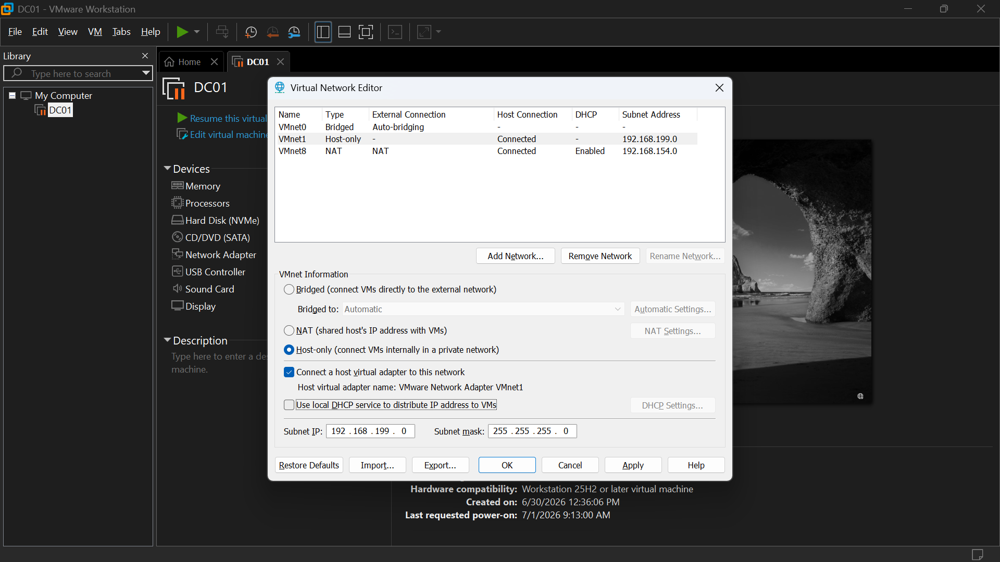
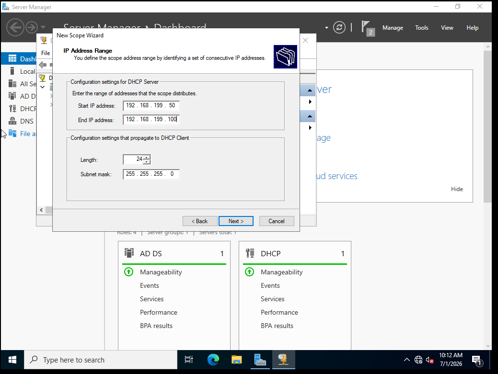
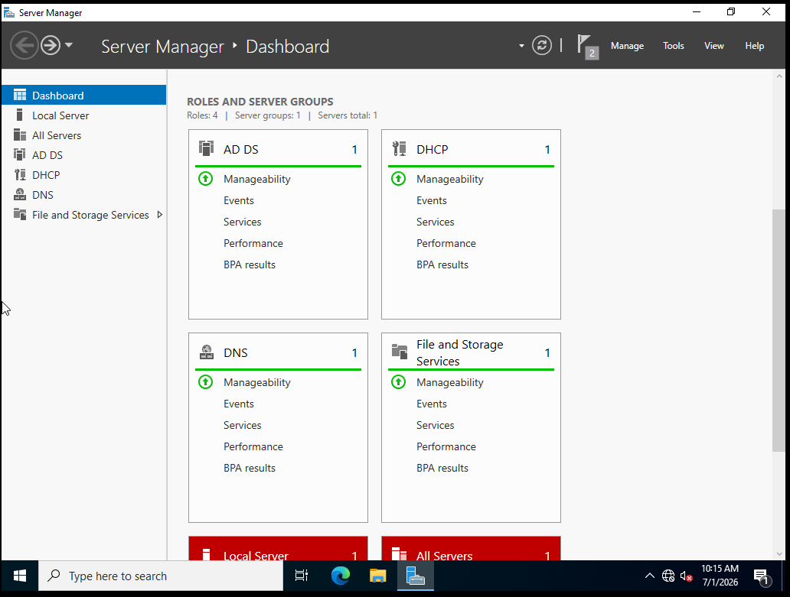

# DC01 — DHCP Server Setup

**Role:** giving the company's main server authority to assign network addresses
**Date:** June 30, 2026

## Summary
Installed and configured the DHCP Server role on DC01, enabling it to
automatically assign IP addresses, subnet info, and DNS settings to future
client machines on the lab network — rather than requiring manual network
configuration on every device, like was done for DC01 itself.

## Conflict Caught and Resolved
Before configuring DHCP on DC01, discovered that VMnet1 (the lab's host-only
network) had VMware's own built-in DHCP service enabled. Running two DHCP
servers on the same subnet risks IP conflicts and inconsistent lease info —
a real issue that occurs on production networks too, often from a
misconfigured or rogue device. Disabled VMware's local DHCP service on
VMnet1 via the Virtual Network Editor before proceeding, making DC01 the
sole DHCP authority on the network.

## Configuration
- Installed the DHCP Server role via Server Manager.
- Completed the required post-install DHCP configuration wizard, which
  authorizes the server in Active Directory to actually issue leases.
- Created a new scope named "Lab Network":
  - Range: 192.168.199.50 – 192.168.199.100
  - Subnet mask: 255.255.255.0
  - DNS server: 192.168.199.10 (DC01)
  - Router/gateway: left blank — no pfSense gateway exists yet
  - Lease duration: default (8 days)
- Activated the scope.

## Verification
Confirmed the new scope shows as active (green) in the DHCP console.

## Screenshots

*Disabled VMware's built-in DHCP service on VMnet1 to avoid two DHCP servers competing on the same subnet.*

*New scope configured with a range that avoids overlap with DC01's static IP.*

*Scope active and ready to lease addresses to future client machines.*

## Next Step
Stand up WIN11-CLIENT and join it to the homelab.local domain — this will
be the first real test of DC01's AD DS, DNS, and DHCP all working together.
