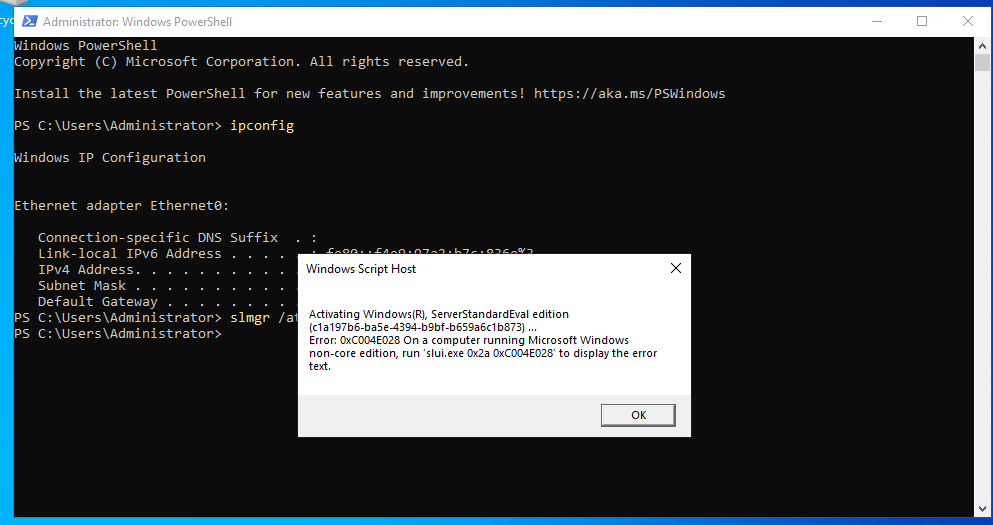

# DC01 Build — Windows Server 2022 Standup
**Role:** the company's main server / domain controller
**Date:** June 30, 2026

## Summary
Built DC01 from scratch in VMware Workstation Pro: created the VM, installed
Windows Server 2022 Standard (Desktop Experience), and verified a clean boot
to Server Manager. This is the baseline state before AD DS / DNS / DHCP
configuration.

## VM Specs
- 2 vCPU, 4 GB RAM, 60 GB disk (NVMe, split into multiple files)
- Network adapter: Custom (VMnet1) — host-only, isolated lab network
- Firmware: UEFI, Secure Boot disabled

## Build Notes
- Used "I will install the operating system later" during VM creation to
  avoid VMware's Easy Install automation — this skips the real Windows Server
  Setup screens, which defeats the purpose of a learning lab.
- Selected **Standard edition with Desktop Experience** over Datacenter —
  Standard is the realistic choice for a small-company domain controller;
  Datacenter is built for heavy virtualization hosts and unlimited VM
  licensing, which doesn't apply here.
- Confirmed the evaluation ISO was genuinely Server 2022 before installing —
  Microsoft's evaluation ISOs across versions share the same generic filename
  (`SERVER_EVAL_x64FRE_en-us.iso`), so the version isn't visible from the
  filename alone. Verified via the Setup screen itself.
- VM files stored at `C:\VirtualMachines` rather than inside a OneDrive-synced
  folder, to avoid OneDrive trying to sync a multi-GB disk file that's
  actively in use.

## Screenshots

*Selected Standard edition with Desktop Experience over Datacenter — realistic choice for a small-company DC.*

*Custom: Install Windows only (advanced).*

*Auto-created partitions on the 60 GB disk.*

*Clean post-install desktop, before any role configuration — this is the baseline state.*

## License Status Check — July 1–2, 2026

### Summary
Checked the Windows Server 2022 Evaluation license clock before building
further on top of DC01. Discovered the evaluation had never actually
completed online activation, then diagnosed and fixed a network
misconfiguration that was blocking it.

### Findings
- `slmgr /dlv` showed **License Status: Initial grace period**, only 10 days
  remaining, with rearm count untouched at 6/6 — meaning the evaluation had
  never gone through real online activation.
- `slmgr /ato` failed with `0x80072EE7` (`DNS (Domain Name System)` /
  connectivity failure) — DC01 had no route to Microsoft's activation
  servers, expected since it sits on host-only VMnet1 with no internet path.
- Added a second `NIC (Network Interface Card)` to the VM, set to
  `NAT (Network Address Translation)`, for temporary internet access.
  Retried activation and got `0xC004E028` repeatedly.
- Diagnosed with `ping` and `nslookup` — both failed completely, ruling out
  "activation still processing" and pointing to a deeper connectivity gap.
- Root cause: the **primary network adapter had drifted onto NAT instead of
  VMnet1**, so DC01's main adapter was never properly reaching a gateway on
  the lab network — this, not the activation service, is what broke
  activation from the start.

### Fix
- Reconfigured the primary **Network Adapter** back to **Custom: VMnet1**.
- Kept **Network Adapter 2** on **NAT**, dedicated to giving DC01 temporary
  internet access for activation.

### Resolution
Resolved. After correcting the adapter configuration, `ping` and `nslookup`
succeeded, `slmgr /ato` returned **"Product activated successfully,"** and the
license flipped from Initial grace period to a full 180-day evaluation.

### Screenshots — Diagnosis

*`slmgr /dlv` showing Initial grace period, 10 days remaining, rearm counts untouched at 6/6 — evaluation had never truly activated.*

*`slmgr /ato` failing with 0x80072EE7 — no internet path from host-only VMnet1.*

*First 0xC004E028 after adding a NAT adapter — activation reaching servers but failing.*

*Same 0xC004E028 after three retries — confirmed it wasn't a transient "still processing" state.*

*`ipconfig` showing only Ethernet0 with no gateway; `ping 8.8.8.8` at 100% loss — a real connectivity gap.*

*`nslookup validation-v2.sls.microsoft.com` timing out — confirmed no DNS path, not just a slow activation server.*

*VM Settings showing BOTH network adapters set to NAT — the primary should have been on VMnet1. Root cause.*

### Screenshots — Fix Verified

*`ipconfig /all` after fix — Ethernet0 back on VMnet1 (192.168.199.10), Ethernet1 on NAT for internet.*

*Ethernet1 now has a gateway and DNS; `ping 8.8.8.8` at 0% loss.*

*`slmgr /ato` returning "Product activated successfully" — license now valid for 180 days.*

## Status
This build (base OS install) was completed and followed by:
1. Promotion to a domain controller via `AD DS (Active Directory Domain Services)`, with `DNS (Domain Name System)` and `DHCP (Dynamic Host Configuration Protocol)` configured (documented separately).
2. The License Status Check above (July 1–2, 2026).

**Next up:** standing up `WIN11-CLIENT (an employee's laptop I'm troubleshooting)` and joining it to the domain.
