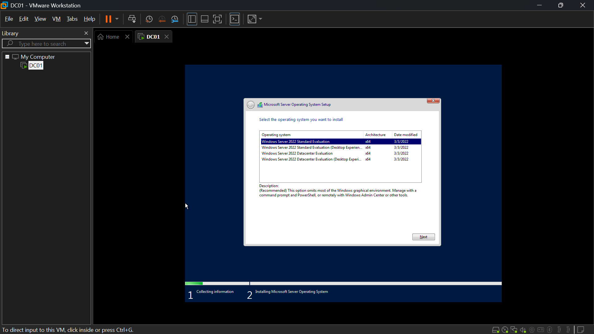
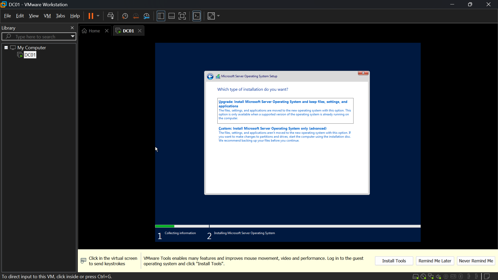
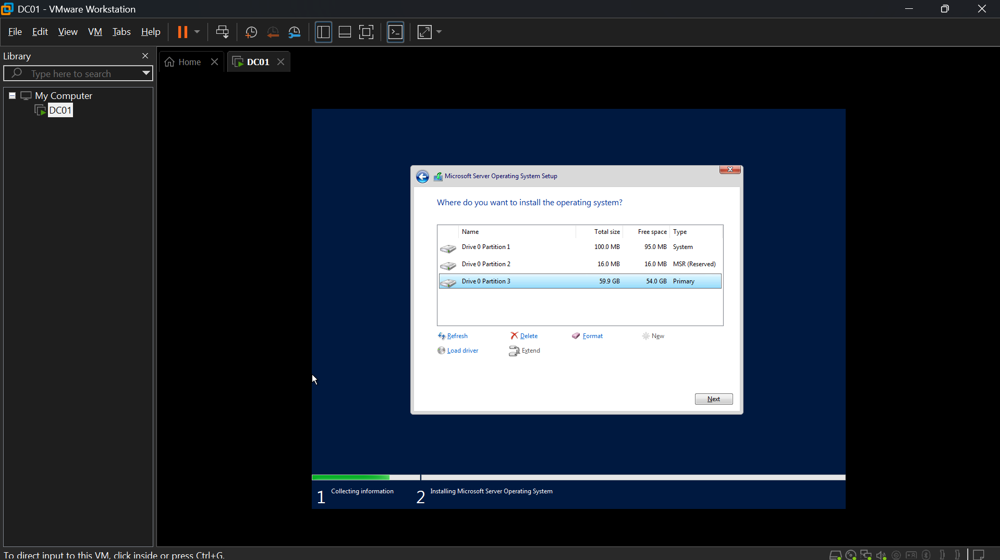
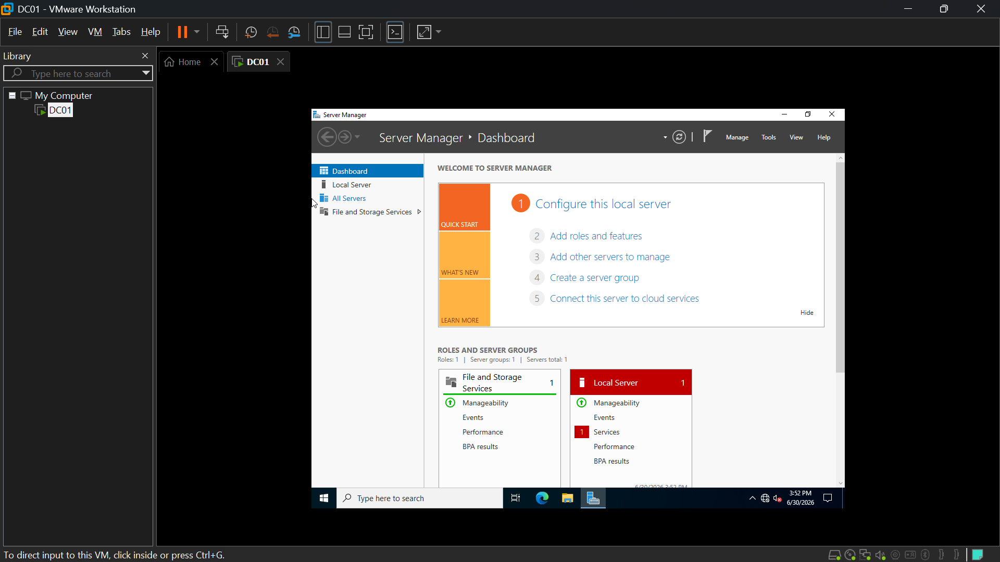

# DC01 Build — Windows Server 2022 Standup
**Role:** the company's main server / domain controller
**Date:** June 30, 2026

## Summary
Built DC01 from scratch in VMware Workstation Pro: created the VM, installed
Windows Server 2022 Standard (Desktop Experience), and verified a clean boot
to Server Manager. This is the baseline state before AD DS / DNS / DHCP
configuration.

## VM Specs
- 2 vCPU, 4 GB RAM, 60 GB disk (NVMe, split into multiple files)
- Network adapter: Custom (VMnet1) — host-only, isolated lab network
- Firmware: UEFI, Secure Boot disabled

## Build Notes
- Used "I will install the operating system later" during VM creation to
  avoid VMware's Easy Install automation — this skips the real Windows Server
  Setup screens, which defeats the purpose of a learning lab.
- Selected **Standard edition with Desktop Experience** over Datacenter —
  Standard is the realistic choice for a small-company domain controller;
  Datacenter is built for heavy virtualization hosts and unlimited VM
  licensing, which doesn't apply here.
- Confirmed the evaluation ISO was genuinely Server 2022 before installing —
  Microsoft's evaluation ISOs across versions share the same generic filename
  (`SERVER_EVAL_x64FRE_en-us.iso`), so the version isn't visible from the
  filename alone. Verified via the Setup screen itself.
- VM files stored at `C:\VirtualMachines` rather than inside a OneDrive-synced
  folder, to avoid OneDrive trying to sync a multi-GB disk file that's
  actively in use.

## Screenshots

*Selected Standard edition with Desktop Experience over Datacenter — realistic choice for a small-company DC.*

*Custom: Install Windows only (advanced).*

*Auto-created partitions on the 60 GB disk.*

*Clean post-install desktop, before any role configuration — this is the baseline state.*

## Status
This build (base OS install) was completed and followed by:
1. Promotion to a domain controller via `AD DS (Active Directory Domain Services)`, with `DNS (Domain Name System)` and `DHCP (Dynamic Host Configuration Protocol)` configured (documented separately).
2. A license activation failure, diagnosed and resolved — see
   [`TICKET-001`](../tickets/ticket-001-dc01-license-activation-failure.md)
   for the full diagnostic writeup and screenshots.

**Next up:** standing up `WIN11-CLIENT (an employee's laptop I'm troubleshooting)` and joining it to the domain.
