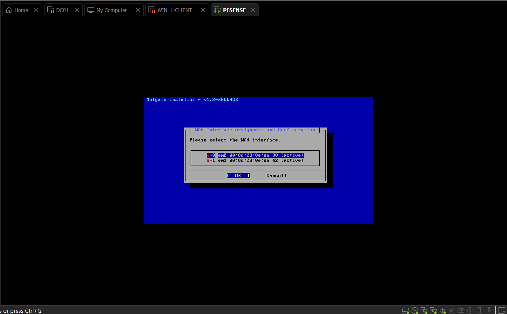
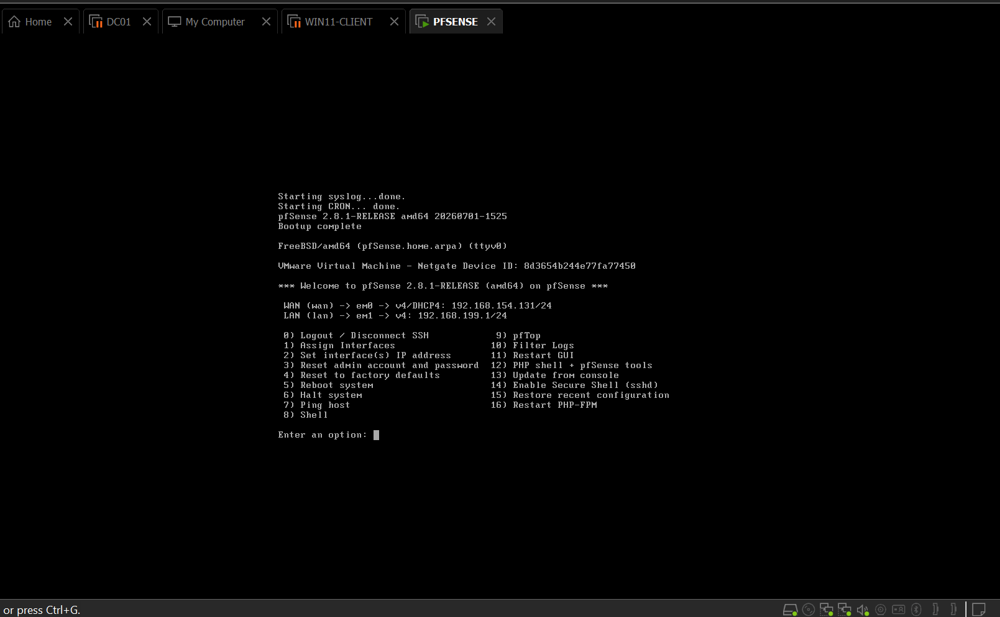
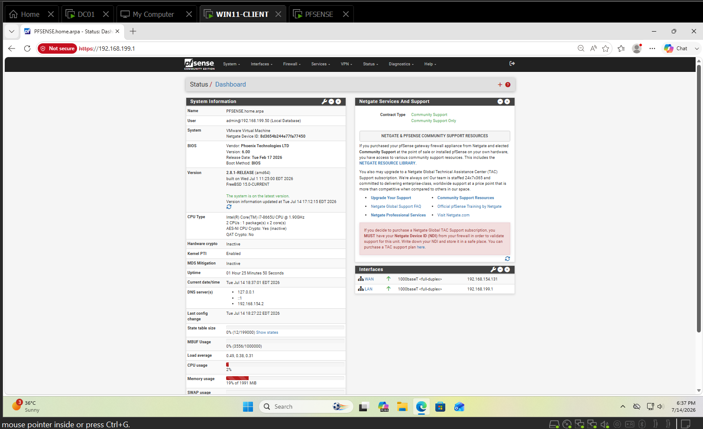

# PFSENSE Build — Firewall / Router / VPN Gateway

`PFSENSE (the company's firewall / router / VPN gateway)` — pfSense
`CE (Community Edition)` 2.8.1, running as a `VM (Virtual Machine)` on
`VMware (Virtual Machine ware)` Workstation. Sits between the internal lab
network and the internet.

## Network Design
| Interface | Adapter | Address | Purpose |
|---|---|---|---|
| `WAN (Wide Area Network)` | NAT (`em0`) | `192.168.154.131/24` (`DHCP`) | Internet, via VMware `NAT (Network Address Translation)` |
| `LAN (Local Area Network)` | VMnet1 (`em1`) | `192.168.199.1/24` (static) | Internal lab network, shared with `DC01` and `WIN11-CLIENT` |

`PFSENSE`'s own `DHCP (Dynamic Host Configuration Protocol)` server is
**disabled** on `LAN` — `DC01 (the company's main server)` already
provides `DHCP` for the `192.168.199.0/24` segment, and running two `DHCP`
servers on one network would conflict.

## VM Configuration
- Guest OS type: FreeBSD 14 64-bit
- 2 GB RAM, 1 processor / 2 cores, 20 GB disk (single file)
- Adapter 1: NAT (becomes `WAN`)
- Adapter 2: VMnet1 / Host-only (becomes `LAN`)

## Install Notes
- pfSense `CE` is downloaded via the Netgate store with a $0 checkout
  (no direct ISO link).
- VMware presents the NICs with the `em` driver, so interfaces appear as
  `em0`/`em1` in the installer, not `vmx0`/`vmx1`.
- Adapter creation order determines assignment: first adapter (NAT) =
  `WAN` = `em0`; second adapter (VMnet1) = `LAN` = `em1`.
- Partitioning: Auto (ZFS), Stripe (single disk).
- After reboot, the installer ISO was disconnected (VM → Removable
  Devices → CD/DVD → Disconnect) to avoid rebooting into the installer.

## Setup Wizard
- Hostname `PFSENSE`, domain `home.arpa` (kept separate from the
  `homelab.local` `AD (Active Directory)` domain — `PFSENSE` is a network
  appliance, not a domain member).
- Timezone `America/Toronto`.
- **Block Private Networks on WAN: disabled.** The lab `WAN` sits on
  VMware `NAT`, which uses private (`RFC1918`) address space. Leaving this
  option enabled would cause `PFSENSE` to drop legitimate return traffic
  from its own upstream gateway. This is a lab-specific setting and would
  normally stay enabled on a real internet-facing firewall.
- Admin password changed from the default.

## Cutover of DC01 and WIN11-CLIENT
Both machines were moved from routing directly out via the VMware `NAT`
adapter to routing through `PFSENSE`:
- `DC01`'s `DHCP` scope option **003 Router** was set to `192.168.199.1`
  so future leases hand out `PFSENSE` as the gateway.
- On each machine, the secondary `NAT` adapter was disabled and the
  `VMnet1` adapter's default gateway set to `192.168.199.1`.

The cutover surfaced two client-side issues (a competing second default
gateway, and a stale `ARP (Address Resolution Protocol)` cache on `DC01`)
that were diagnosed and resolved — documented as a break/fix ticket in
[tickets/ticket-010-dc01-no-internet-after-gateway-cutover.md](../tickets/ticket-010-dc01-no-internet-after-gateway-cutover.md).

## Verification
- `PFSENSE` `WAN` gateway `192.168.154.2`: Online.
- `DC01` and `WIN11-CLIENT`: `ping 8.8.8.8` 0% loss, external `DNS
  (Domain Name System)` resolving.

## Screenshots

*Installer interface picker — NICs appear as `em0`/`em1` under the
VMware `em` driver. `em0` (first adapter, NAT) = `WAN`; `em1` (second
adapter, VMnet1) = `LAN`.*

*pfSense console showing `WAN` and `LAN` interfaces assigned and
addressed.*

*pfSense dashboard with both interfaces up.*

## Still Ahead
- Tighten firewall rules (default `LAN`-to-any allow is fine for now, not
  representative of a real company firewall).
- Unlocks Ticket 8 (previously blocked on `PFSENSE` existing).
