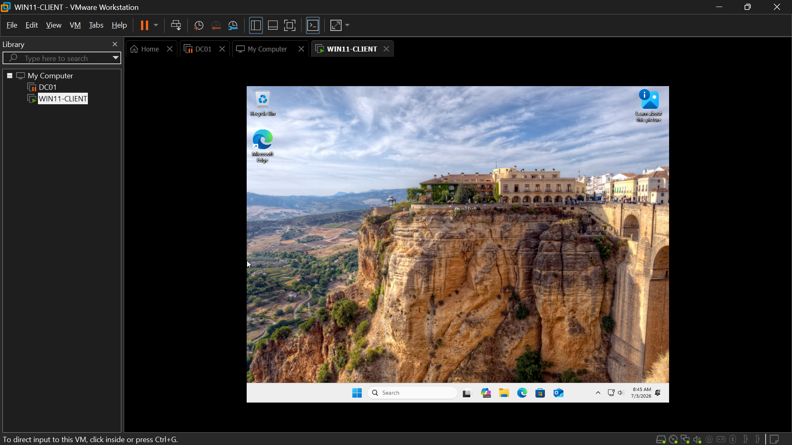

# WIN11-CLIENT Build — Windows 11 Standup
**Role:** an employee's laptop I'm troubleshooting
**Date:** July 2, 2026

## Summary
Built WIN11-CLIENT from scratch in VMware Workstation Pro: created the VM
with a virtual `TPM (Trusted Platform Module)` and `UEFI (Unified Extensible
Firmware Interface)` Secure Boot enabled to meet Windows 11's real hardware
requirements, then installed Windows 11 Pro. This mirrors how a company would
actually deploy Windows 11, rather than bypassing the hardware checks.

## VM Specs
- 2 vCPU, 4 GB RAM, 64 GB disk (NVMe, split into multiple files)
- Firmware: UEFI with Secure Boot enabled
- Virtual TPM 2.0 added (TPM data encrypted, password stored in Credential Manager)
- Network adapter: NAT (temporary — will be reassigned once domain-join network segment is confirmed)

## Build Notes
- Selected **Custom (advanced)** VM creation and **I will install the
  operating system later**, matching the same realistic approach used for
  `DC01 (the company's main server)`.
- VMware auto-prompted for TPM encryption configuration mid-wizard since
  Windows 11 was selected as the guest OS — chose to encrypt only the files
  needed to support the virtual TPM (`.nvram`, `.vmss`, `.vmem`, `.vmx`,
  `.vmsn`), not the entire VM, to keep overhead low. TPM password stored in a
  password manager, not in this repo.
- Enabled Secure Boot under Firmware Type during VM creation — required
  alongside the TPM for Windows 11 to install without hardware-check
  workarounds.
- Downloaded the official Windows 11 multi-edition ISO directly from
  Microsoft's software download page, rather than reusing an existing
  Windows 10 ISO found on the host — a mismatched OS ISO against a
  TPM/Secure-Boot-configured VM would have caused install issues.
- Selected **Windows 11 Pro** edition during setup — realistic choice for a
  company-issued employee laptop.
- Confirmed clean boot into Windows 11 Setup with no "This PC can't run
  Windows 11" error, validating the TPM/Secure Boot configuration was done
  correctly on the first attempt.
- Avoided the Microsoft-account-required OOBE path by choosing **Set up for
  work or school > Sign-in options > Domain join instead** — creates a
  genuine local account without needing actual domain connectivity or a
  registry bypass. The account-creation screen ran through twice during this
  flow: `localadmin` was created on the first pass, then `jsmith` on the
  second after `localadmin` was rejected as already taken. Both are
  intentionally-created local accounts, not a discovered rogue account.
  Password for `localadmin` is known and retained.
- VM lost power state once mid-build (host ran out of memory resuming from
  suspend) — preserved the suspended state rather than discarding, freed host
  RAM, and resumed successfully with no data loss.

## Screenshots

*Clean desktop after first login as jsmith — OS install fully complete.*

## Next Step
Reassign the network adapter from NAT to VMnet1 so WIN11-CLIENT can reach
`DC01 (the company's main server)`, then join WIN11-CLIENT to the
`homelab.local` domain.
