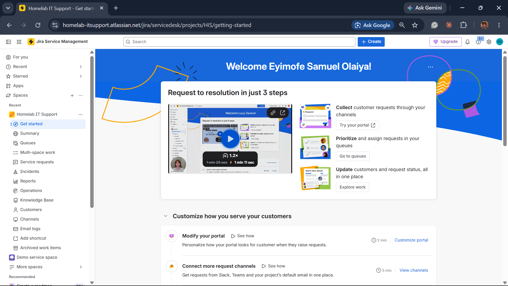

# Ticketing System Setup

## What
`Jira Service Management` (Free plan) — `Basic IT service management` template.

## Why
`ServiceNow`'s `PDI (Personal Developer Instance)` provisioning was
unavailable (repeated "unable to assign an instance" errors, waitlisted for
the Yokohama release). `Freshservice` was considered as a fallback, but its
free tier is a 14-day trial rather than free-forever. `Jira Service
Management`'s Free plan supports up to 3 agents with no trial expiry at
all, which fits a one-person lab better than a countdown-based trial.

## Details
- **Site:** `https://homelab-itsupport.atlassian.net`
- **Project name:** Homelab IT Support
- **Project key:** HIS
- **Template:** Basic IT service management
- **Team type:** Information technology (IT)
- **Channel access:** Restricted — only added users can submit requests,
  matching a real internal company help desk rather than a public portal

Login credentials are stored in a password manager, not in this repo.

## Screenshot

*Homelab IT Support project live in Jira Service Management — Queues, Service requests, Incidents, Reports, and Knowledge Base all provisioned from the Basic IT service management template.*
