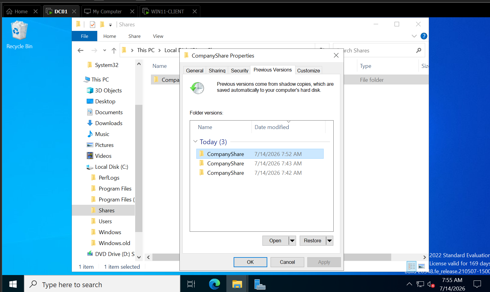
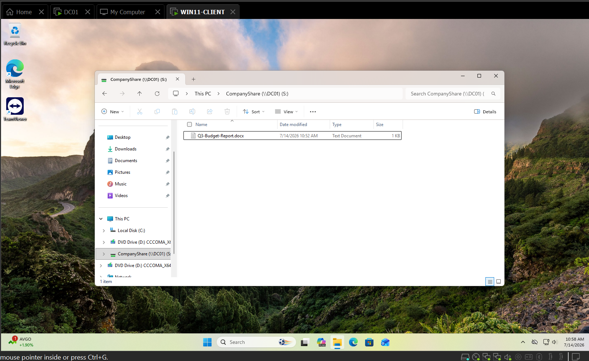

# TICKET-006 — jsmith Reports Deleted File on CompanyShare (Q3-Budget-Report.docx)

| Field | Detail |
|---|---|
| **Status** | Resolved |
| **Priority** | Medium |
| **Category** | Backup & Recovery |
| **Affected System** | `DC01 (the company's main server)` — `C:\Shares\CompanyShare`, mapped as `S:` drive on `WIN11-CLIENT (an employee's laptop I'm troubleshoot)` |
| **Reporter** | jsmith (employee) |
| **Ticketing system** | Jira Service Management — [HIS-6](https://homelab-itsupport.atlassian.net/jira/servicedesk/projects/HIS/section/incidents/custom/10/HIS-6) |
| **Date Opened / Closed** | July 14, 2026 (same day) |

## Summary
Employee jsmith reported that `Q3-Budget-Report.docx`, previously saved to
the shared drive (`S:` mapped to `\\DC01\CompanyShare`), was missing.
The file was not in the local Recycle Bin. Recovered using a
`VSS (Volume Shadow Copy Service)` snapshot on `DC01` via the
**Previous Versions** feature.

## Symptoms
- `Q3-Budget-Report.docx` no longer present in `\\DC01\CompanyShare`
  (`S:` drive on `WIN11-CLIENT`).
- File not recoverable from the local Recycle Bin, since it was deleted
  server-side from the share, not from the client.

## Environment Prep
`VSS` was not previously enabled on `DC01`. As part of setting up this
scenario:
1. Enabled Shadow Copies on the `C:` volume via **Configure Shadow
   Copies** (right-click `C:` in File Explorer).
2. Confirmed default settings — max size ~10% of volume, twice-daily
   schedule.
3. Created `Q3-Budget-Report.docx` in `C:\Shares\CompanyShare`, then
   manually triggered a snapshot (**Create Now**) to capture a restore
   point containing the file.
4. Deleted the file from `C:\Shares\CompanyShare` to simulate the
   accidental deletion.

## Diagnostic Steps
1. Confirmed on `WIN11-CLIENT` as jsmith that the file was genuinely
   absent from the mapped `S:` drive, ruling out a client-side sync or
   visibility issue.
2. On `DC01`, navigated to `C:\Shares\` and opened **Properties** →
   **Previous Versions** on the `CompanyShare` folder.
3. Confirmed a shadow copy snapshot was available, predating the
   deletion.

## Resolution
1. Opened the available snapshot from the **Previous Versions** tab.
2. Located `Q3-Budget-Report.docx` inside the snapshot and copied it.
3. Pasted the file back into the live `C:\Shares\CompanyShare` folder.
4. Verified on `WIN11-CLIENT` that `Q3-Budget-Report.docx` reappeared on
   the mapped `S:` drive.

**Root cause:** User-initiated deletion — no underlying system fault.
**Fix:** `VSS`-based file recovery from a shadow copy snapshot.

## Screenshots

*Properties → Previous Versions tab on the CompanyShare folder, showing
the shadow copy snapshot taken before the file was deleted.*

*Q3-Budget-Report.docx confirmed present again on jsmith's mapped S:
drive on WIN11-CLIENT.*

## Tools Used
`VSS (Volume Shadow Copy Service)`, File Explorer, Jira Service
Management.

## Time to Resolve
Same-day, under 30 minutes.
