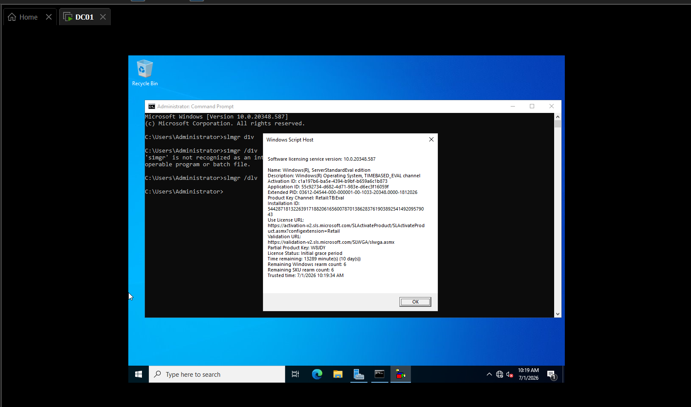
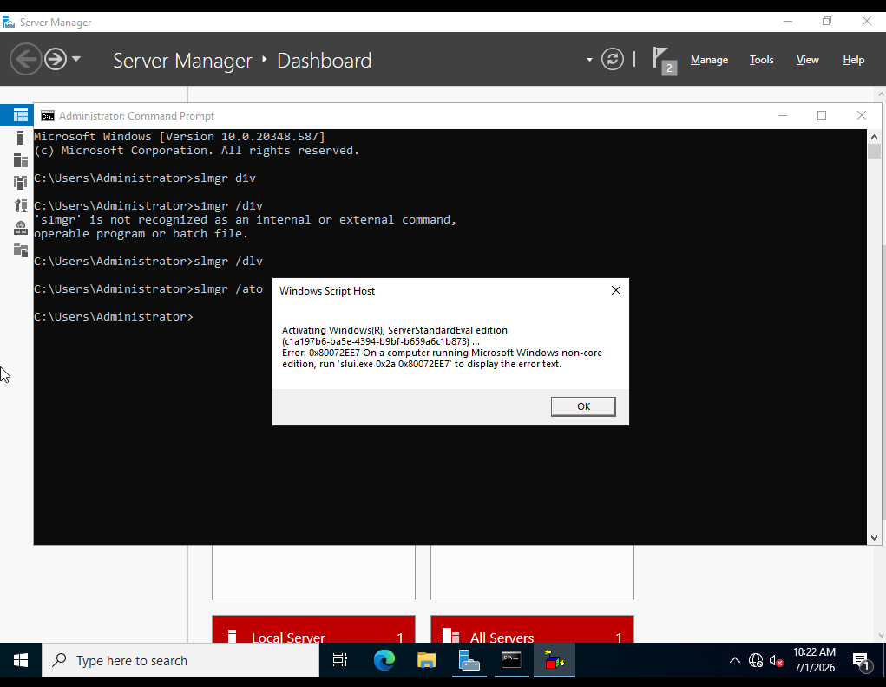
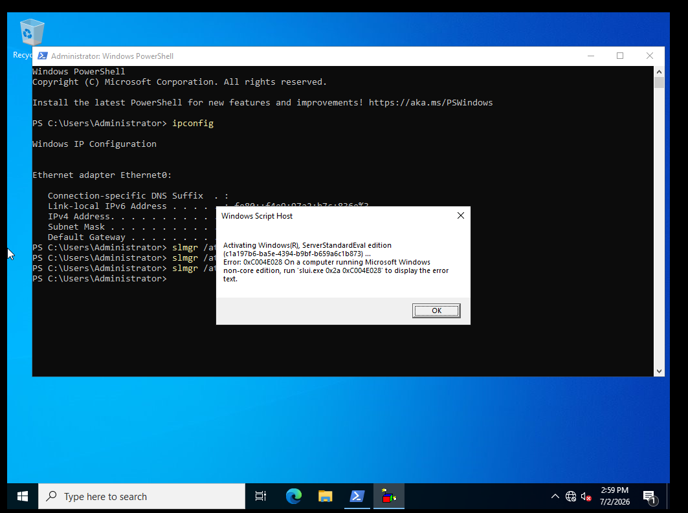
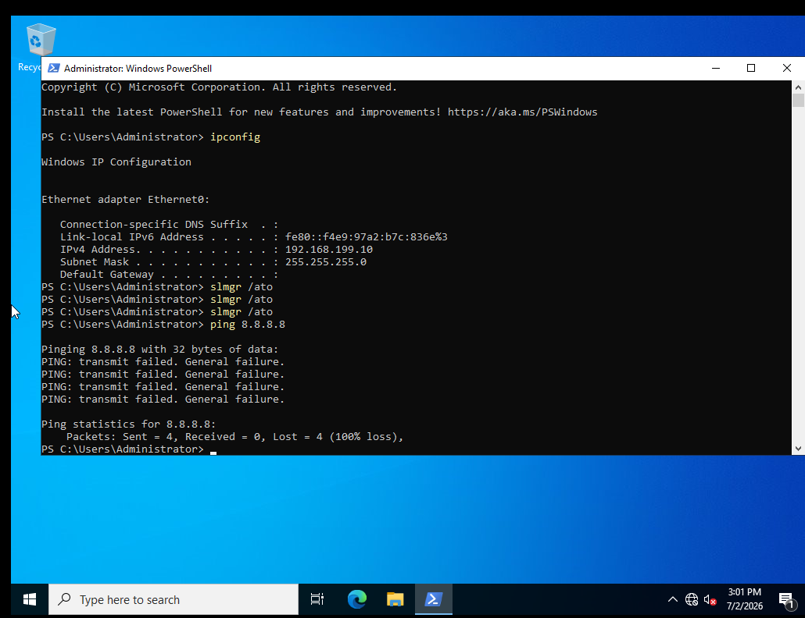
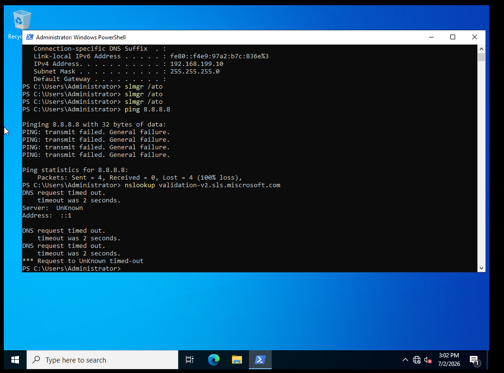
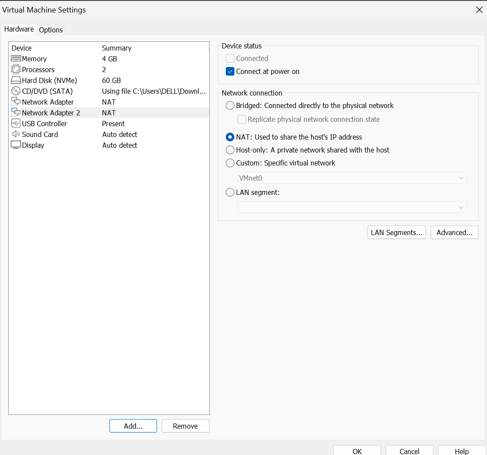
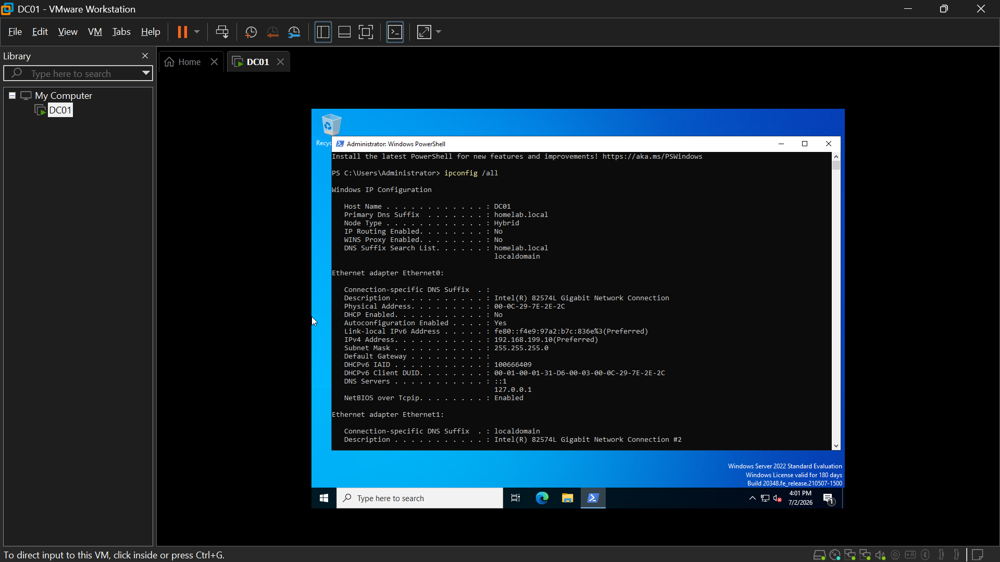
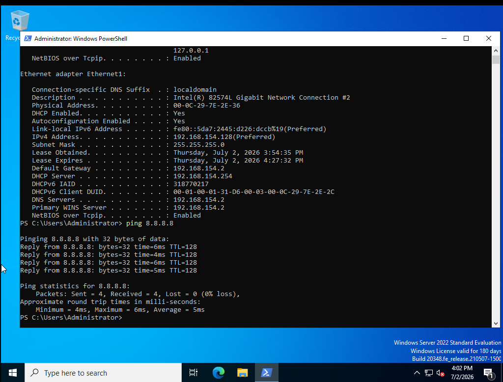
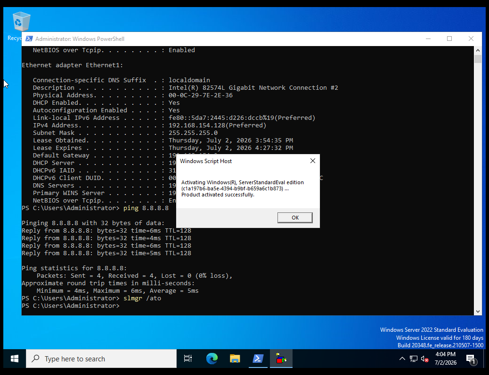

# TICKET-000 — DC01 License Activation Failure

| Field | Detail |
|---|---|
| **Status** | Resolved |
| **Priority** | High (blocking further infrastructure work) |
| **Category** | Server / Licensing / Networking |
| **Affected System** | `DC01 (the company's main server)` — Windows Server 2022 Standard Evaluation |
| **Reported By** | Self — detected during routine license check, prior to ticketing system deployment |
| **Date Opened** | July 1, 2026 |
| **Date Closed** | July 2, 2026 |

## Summary
Routine license check on `DC01` revealed the Windows Server 2022 Evaluation
had never completed real activation and had only 10 days left in its initial
grace period. Diagnosed and resolved a network misconfiguration that had
silently blocked activation since the server was built.

## Symptoms
- `slmgr /dlv` reported **License Status: Initial grace period**, 10 days
  remaining, rearm count untouched at 6/6 — evidence the evaluation had never
  gone through online activation at all.
- Manually running `slmgr /ato` failed outright.

## Diagnostic Steps
1. Ran `slmgr /dlv` to confirm exact license state and time remaining.
2. Ran `slmgr /ato` to force activation — failed with `0x80072EE7`
   (`DNS (Domain Name System)` / connectivity failure). Root cause suspected:
   `DC01` sits on host-only `VMnet1 (the isolated lab-only network)` with no
   route to the internet, so it can't reach Microsoft's activation servers.
3. Added a second `NIC (Network Interface Card)` to the VM, set to
   `NAT (Network Address Translation)`, to give `DC01` a path to the internet
   without disturbing its existing static configuration.
4. Retried `slmgr /ato` — now failed with `0xC004E028`, repeated across
   multiple attempts. This ruled out a simple "activation in progress" state.
5. Ran `ping 8.8.8.8` and `nslookup validation-v2.sls.microsoft.com` to test
   raw connectivity independent of the activation service. Both failed
   completely — `ipconfig` showed only the original adapter, with no default
   gateway at all.
6. Opened VM network settings and found **both** network adapters set to
   `NAT` — the primary adapter, which should have carried `DC01`'s static
   `IP (Internet Protocol)` on `VMnet1`, had drifted onto `NAT` instead.

## Root Cause
The primary network adapter was misconfigured to `NAT` instead of `VMnet1`.
This meant `DC01` had never had a properly routed connection on its intended
lab network *or* a working path to the internet — the activation failures
were a symptom of this deeper misconfiguration, not a licensing-service
problem.

## Resolution
1. Set the primary **Network Adapter** back to **Custom: VMnet1**.
2. Left **Network Adapter 2** on **NAT**, dedicated to giving `DC01` internet
   access going forward (kept in place rather than removed — the upcoming
   `Microsoft 365 (cloud tenant providing Entra ID and Intune)` tenant join
   will need outbound internet from the domain).
3. Verified with `ipconfig /all`: `Ethernet0` restored to `192.168.199.10` on
   `VMnet1`, `Ethernet1` showing a valid gateway and `DNS` server via `NAT`.
4. Re-ran `ping 8.8.8.8` — 0% packet loss.
5. Re-ran `slmgr /ato` — **"Product activated successfully."** License now
   valid for a full 180-day evaluation window.

## Screenshots

*`slmgr /dlv` — Initial grace period, 10 days remaining, rearm counts untouched at 6/6.*

*`slmgr /ato` failing with 0x80072EE7 — no internet path from host-only VMnet1.*

*Same 0xC004E028 across multiple attempts — ruled out a transient state.*

*Only one adapter present, no gateway; ping at 100% loss.*

*DNS resolution timing out — confirmed a real connectivity gap, not a slow server.*

*VM Settings — both adapters incorrectly set to NAT. Root cause identified.*

*ipconfig /all after fix — Ethernet0 back on VMnet1, Ethernet1 on NAT.*

*Ping at 0% loss after the fix.*

*"Product activated successfully" — 180-day license confirmed.*

## Tools Used
`PowerShell (Windows PowerShell)`, `slmgr (Software Licensing Management Tool)`,
`ping`, `nslookup`, VMware Workstation Pro network configuration.

## Time to Resolve
Spanned two sessions, July 1–2, 2026 (not continuous active troubleshooting time).

## Resume-Ready Summary
Diagnosed and resolved a server license activation failure caused by a
misconfigured network adapter, restoring full licensing compliance and
internet connectivity through systematic testing with `ping`, `nslookup`,
and `slmgr`.
