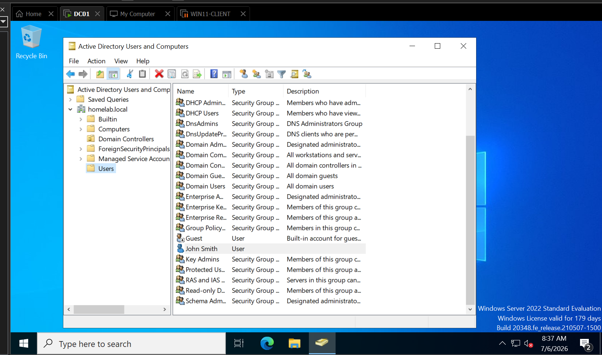
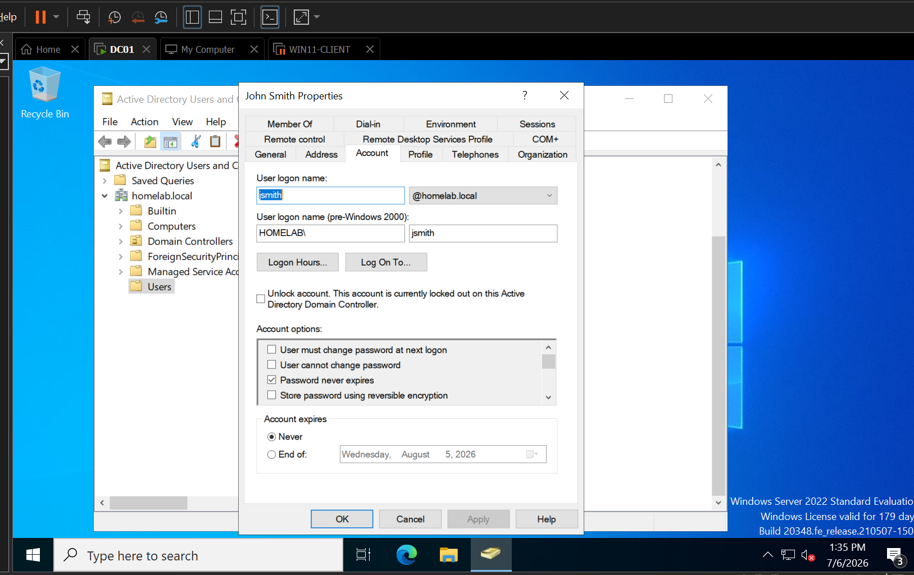
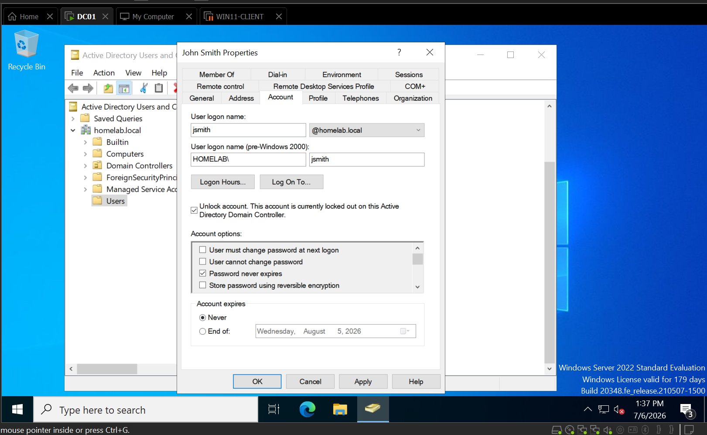
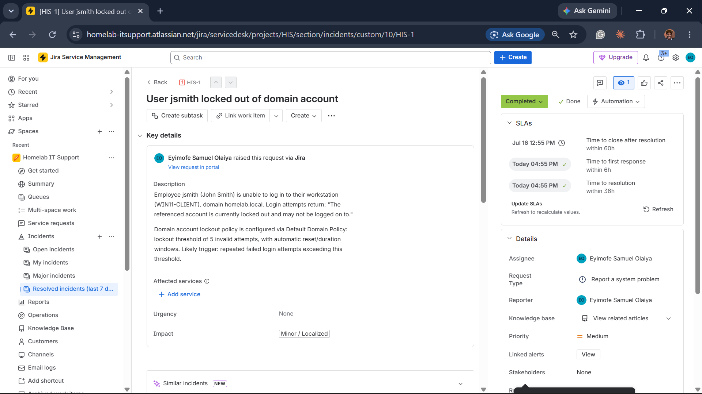
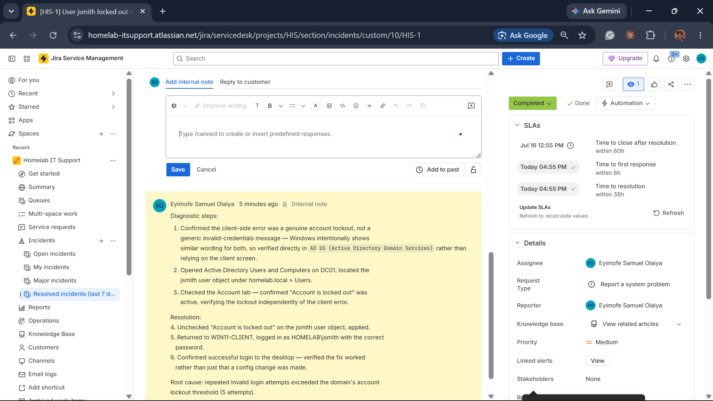

# TICKET-001 — User jsmith Locked Out of Domain Account

| Field | Detail |
|---|---|
| **Status** | Resolved |
| **Priority** | Medium |
| **Category** | Identity & Access |
| **Affected System** | `WIN11-CLIENT (an employee's laptop I'm troubleshooting)` / `homelab.local` domain account |
| **Reporter** | Employee (jsmith / John Smith) |
| **Ticketing system** | Jira Service Management — [HIS-1](https://homelab-itsupport.atlassian.net/jira/servicedesk/projects/HIS/section/incidents/custom/10/HIS-1) |
| **Date Opened / Closed** | July 6, 2026 (same day) |

## Summary
Employee `jsmith` (John Smith) was unable to log in to `WIN11-CLIENT`,
receiving a generic lockout message. Verified the lockout directly in
`AD DS (Active Directory Domain Services)` rather than trusting the
client-side error, then unlocked the account and confirmed a successful
login.

## Symptoms
- Login attempts on `WIN11-CLIENT` as `HOMELAB\jsmith` returned: **"The
  referenced account is currently locked out and may not be logged on to."**
- Prior to that, repeated attempts also surfaced a generic **"Invalid
  credentials, delaying next attempt..."** throttling message — a separate,
  earlier stage of Windows' brute-force protection, not the lockout itself.

## Environment Prep
Before this ticket, the domain had no account lockout policy configured —
by default, `Windows Server`'s `Default Domain Policy` has no lockout
threshold set. Configured one as a security baseline:
- **Account lockout threshold:** 5 invalid attempts
- **Lockout duration / reset counter:** default (30 minutes each)

Applied via **Group Policy Management > Default Domain Policy > Computer
Configuration > Policies > Windows Settings > Security Settings > Account
Policies > Account Lockout Policy**, then `gpupdate /force` on `DC01
(the company's main server)`.

## Diagnostic Steps
1. Confirmed the client-side error was a genuine account lockout, not a
   generic invalid-credentials message — Windows intentionally shows similar
   wording for both, so verified directly in `AD DS` rather than relying on
   the client screen.
2. Opened **Active Directory Users and Computers** on `DC01`, located the
   `jsmith` user object under `homelab.local > Users`.
3. Checked the **Account** tab — confirmed the **"Unlock account..."**
   control was present and unchecked, meaning the account was locked and not
   yet remediated, verifying the lockout independently of the client error.

## Root Cause
Repeated invalid login attempts exceeded the domain's account lockout
threshold (5 attempts), automatically locking the account per the newly
configured `Default Domain Policy`.

## Resolution
1. Checked **"Unlock account..."** on the `jsmith` user object's Account tab,
   applied.
2. Returned to `WIN11-CLIENT`, logged in as `HOMELAB\jsmith` with the correct
   password.
3. Confirmed successful login to the desktop — verified the fix worked
   rather than just that a config change was made.

## Screenshots

*jsmith (John Smith) domain user account listed under homelab.local > Users.*

*WIN11-CLIENT login showing "The referenced account is currently locked out and may not be logged on to."*

*Account tab showing the Unlock account control present and unchecked — confirms the lockout independently of the client-side message.*

*Unlock account checked — the remediation action being applied.*

*Successful desktop login as HOMELAB\jsmith after the unlock — proof the fix actually worked.*

*HIS-1 in Jira Service Management, showing the incident description and Completed status.*

*Internal comment on HIS-1 documenting the full diagnostic and resolution steps.*

## Tools Used
`Active Directory Users and Computers`, `Group Policy Management`,
`Jira Service Management`, `WIN11-CLIENT` login screen.

## Time to Resolve
Same-day, under 2 hours including environment prep (lockout policy
configuration).
