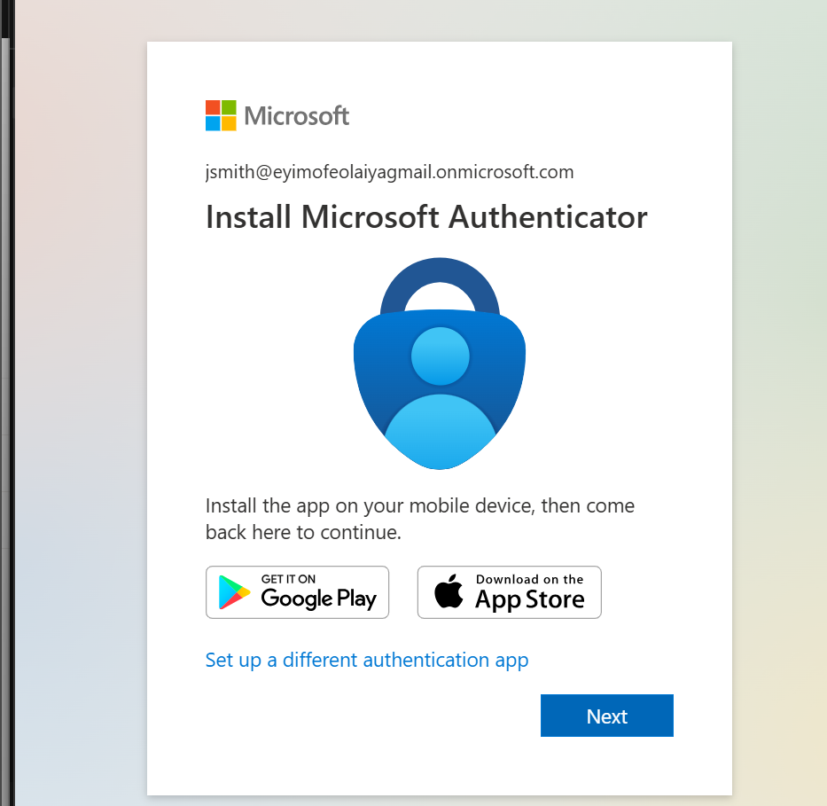
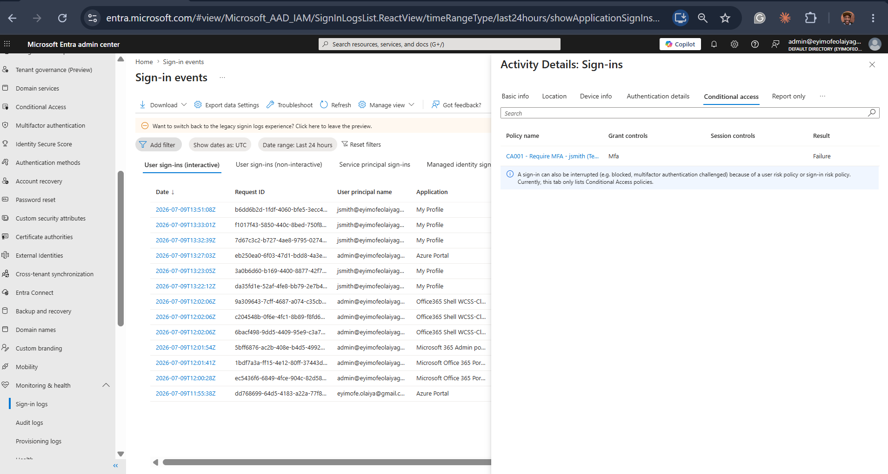
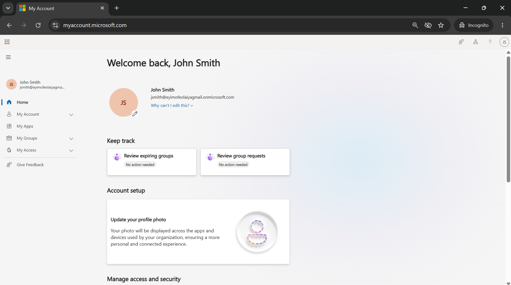

# TICKET-002 — jsmith Blocked at Sign-In by Conditional Access MFA Requirement

| Field | Detail |
|---|---|
| **Status** | Resolved |
| **Priority** | Medium |
| **Category** | Identity & Access |
| **Affected System** | `Microsoft Entra ID (formerly Azure AD)` cloud identity — jsmith |
| **Reporter** | New employee (jsmith / John Smith) — cloud onboarding |
| **Ticketing system** | Jira Service Management — [HIS-2](https://homelab-itsupport.atlassian.net/jira/servicedesk/projects/HIS/section/incidents/custom/10/HIS-2) |
| **Date Opened / Closed** | July 9, 2026 (same day) |

## Summary
New cloud-only employee `jsmith` (John Smith) could not get past sign-in at
`myaccount.microsoft.com` — every attempt landed on an MFA enrollment screen
with no way through. Diagnosed via `Entra ID` sign-in logs, confirming a
`Conditional Access` policy requiring `MFA (Multi-Factor Authentication)`
was blocking the sign-in because jsmith had no authentication method
registered yet. Resolved by walking jsmith through Microsoft Authenticator
registration.

## Symptoms
- Signing in as jsmith at `myaccount.microsoft.com` with the correct
  temporary password redirected to an **"Install Microsoft Authenticator"**
  screen instead of the account dashboard, with no option to skip.
- No password-change prompt appeared first, which didn't match the expected
  new-account flow — this turned out to be sequencing, not a fault (see
  Resolution).

## Environment Prep
A `Conditional Access` policy (`CA001 - Require MFA - jsmith (Test)`) was
built ahead of this ticket to require MFA for jsmith across all resources,
simulating a real onboarding scenario where a new hire hits an MFA
enrollment wall before they know what to do with it. Full policy build
steps are in `builds/entra-id-tenant-setup.md`.

## Diagnostic Steps
1. Reproduced the sign-in as jsmith in an `InPrivate` browser session —
   confirmed it lands on the MFA enrollment screen after correct
   credentials, not the account dashboard.
2. Checked `Entra ID` > Monitoring & health > Sign-in logs > User sign-ins
   (interactive), filtered by user jsmith.
3. Found multiple jsmith sign-in attempts logged with Status
   **"Interrupted."**
4. Opened the most recent entry's `Conditional Access` tab — confirmed
   `CA001 - Require MFA - jsmith (Test)` applied, Grant control **"Mfa,"**
   Result **"Failure"** — the definitive, logged cause of the block.

## Root Cause
jsmith is targeted by `CA001`, which requires MFA for every sign-in. Since
jsmith's account had no MFA method registered, the policy interrupted every
attempt until one was set up — expected behavior working as designed, not a
misconfiguration.

## Resolution
1. Returned to the interrupted sign-in flow in the `InPrivate` window.
2. Installed Microsoft Authenticator on a mobile device and completed the
   QR code pairing to register it against jsmith's account.
3. Approved the verification prompt to finish MFA registration.
4. Completed the forced password change, which Entra ID presented
   immediately after MFA registration rather than before it.
5. Confirmed successful sign-in — landed on the `myaccount.microsoft.com`
   dashboard as "Welcome back, John Smith," verifying the fix actually
   worked rather than just that a config change was made.

## Screenshots

*jsmith's sign-in interrupted by Conditional Access, landing on "Install Microsoft Authenticator" instead of the account dashboard.*

*Sign-in log entry's Conditional Access tab showing CA001 - Require MFA - jsmith (Test), Grant control "Mfa," Result "Failure" — the exact policy causing the block.*

*myaccount.microsoft.com showing "Welcome back, John Smith" after completing MFA registration — confirms the fix.*

## Tools Used
`Microsoft Entra admin center`, `Conditional Access`, `Microsoft
Authenticator`, `Jira Service Management`, `myaccount.microsoft.com`.

## Time to Resolve
Same-day, under 1 hour once the sign-in log evidence was located.
