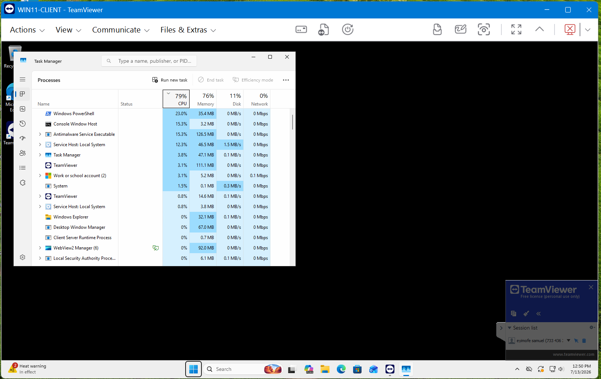
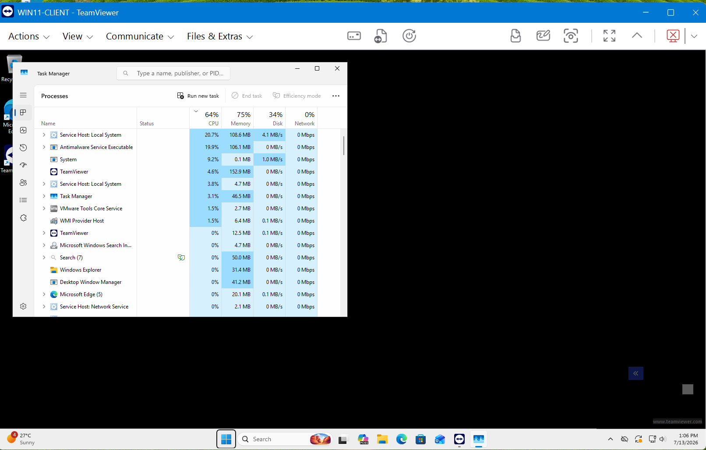

# TICKET-003 — WIN11-CLIENT High CPU, Resolved via Remote Support Session

| Field | Detail |
|---|---|
| **Status** | Resolved |
| **Priority** | Medium |
| **Category** | Endpoint Performance / Desktop Support |
| **Affected System** | `WIN11-CLIENT (an employee's laptop I'm troubleshooting)` |
| **Reporter** | jsmith (employee) — phoned in, requested remote assistance |
| **Ticketing system** | Jira Service Management — [HIS-3](https://homelab-itsupport.atlassian.net/jira/servicedesk/projects/HIS/section/incidents/custom/10/HIS-3) |
| **Date Opened / Closed** | July 13, 2026 (same day) |

## Summary
Employee jsmith reported `WIN11-CLIENT` had become slow and unresponsive,
with applications taking noticeably longer to open. Rather than walking
over to the machine, this was resolved entirely through a live remote
support session — connecting via TeamViewer, diagnosing the cause in Task
Manager, and resolving it without ever touching the local console.

## Symptoms
- Employee reported the laptop feeling sluggish and slow to respond over
  roughly the past hour, with no obvious trigger identified on their end.
- Once connected remotely, Task Manager showed total CPU pegged at ~79%,
  with a background **"Windows PowerShell"** process consuming ~23% CPU —
  notable because no interactive PowerShell console or session was open.

## Environment Prep
A hidden, unterminated PowerShell loop was deliberately started on
`WIN11-CLIENT` ahead of this ticket to simulate a realistic "why is my
laptop slow" call — the kind of vague performance complaint that requires
active diagnosis rather than a known, named error.

## Diagnostic Steps
1. Connected to `WIN11-CLIENT` remotely via TeamViewer, authenticating with
   the domain Administrator account.
2. Opened Task Manager (Ctrl+Shift+Esc) inside the remote session.
3. Sorted the Processes tab by CPU, descending.
4. Identified **"Windows PowerShell"** consuming sustained high CPU with no
   associated console window — flagged as anomalous, since nothing on the
   employee's end should have an unattended PowerShell process running.

## Root Cause
A hidden PowerShell process was running an unterminated loop in the
background, consuming sustained CPU with no legitimate parent session
tied to it.

## Resolution
1. Selected the offending "Windows PowerShell" process in Task Manager.
2. Ended the task.
3. Confirmed the process did not respawn.
4. Monitored total CPU over the following minutes — it trended down (79%
   -> 72% -> 64%) as Windows Defender completed a scan triggered by the
   anomalous activity it had just observed. This was recognized as
   expected, self-resolving background behavior rather than a sign the fix
   hadn't worked — the reported symptom (the runaway process) was
   confirmed resolved, rather than waiting for total CPU to hit an
   unrealistic 0%, which normal OS and security activity will never
   actually allow.
5. Disconnected the remote session.

## Screenshots

*Task Manager during the remote session — total CPU at 79%, with "Windows PowerShell" consuming ~23% and no associated console window.*

*Task Manager after ending the offending process — "Windows PowerShell" no longer present in the process list; remaining load attributed to a transient Windows Defender scan.*

## Tools Used
`TeamViewer`, `Task Manager`, `PowerShell`, `Jira Service Management`.

## Time to Resolve
Same-day, under 30 minutes once connected.
