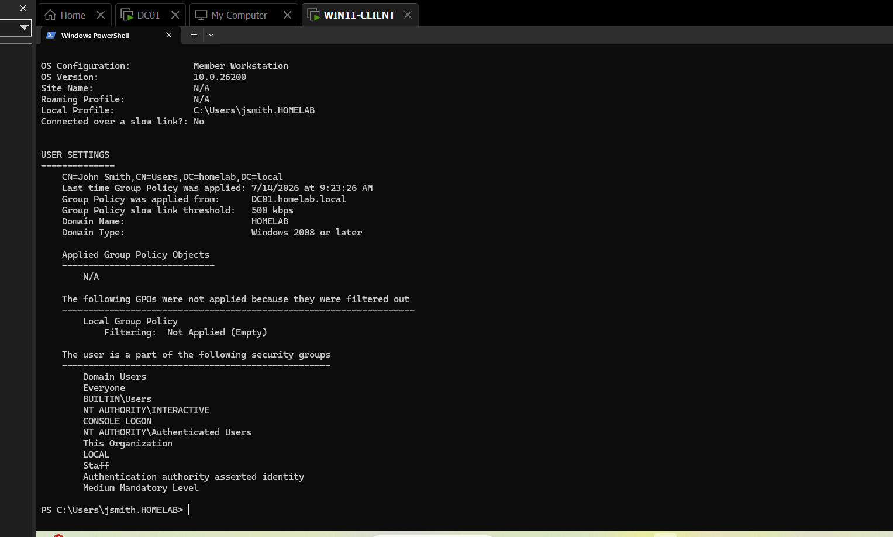

# TICKET-004 — WIN11-CLIENT Cannot Reach \\DC01\CompanyShare (SMB Blocked, GPO Not Applying)

| Field | Detail |
|---|---|
| **Status** | Resolved |
| **Priority** | Medium |
| **Category** | Files & Permissions / Group Policy |
| **Affected System** | `WIN11-CLIENT (an employee's laptop I'm troubleshooting)` / `DC01 (the company's main server)` — `\\DC01\CompanyShare` |
| **Reporter** | Self-identified during environment build/validation (not a simulated employee report) |
| **Ticketing system** | Jira Service Management — [HIS-4](https://homelab-itsupport.atlassian.net/jira/servicedesk/projects/HIS/section/incidents/custom/10/HIS-4) |
| **Date Opened / Closed** | July 14, 2026 (same day) |

## Summary
While validating the `CompanyShare` drive-mapping baseline ahead of a
planned lockout-style ticket, jsmith's `S:` drive never appeared after
`gpupdate /force`. This turned into a genuine two-layer diagnostic hunt:
`SMB (Server Message Block)` access was blocked outright by disabled
network sharing settings, and once that was fixed, the drive-mapping
`GPO (Group Policy Object)` still wasn't applying — for a completely
separate reason.

## Symptoms
- The `S:` drive did not appear after `gpupdate /force`, despite jsmith
  being a member of the `Staff` security group.
- Attempting `\\DC01\CompanyShare` directly (Win+R) opened a Network view
  with the banner **"Network discovery and file sharing are turned off."**
- After enabling those settings, the `UNC (Universal Naming Convention)`
  path opened successfully, but the `S:` drive mapping still did not apply
  via `GPO`.

## Diagnostic Steps
1. Ran `gpupdate /force` on `WIN11-CLIENT` — no `S:` drive appeared.
2. Attempted the direct `UNC` path `\\DC01\CompanyShare` — Explorer opened
   to an empty Network view, blocked by disabled sharing settings.
3. Checked `WIN11-CLIENT`'s network profile (Settings > Network & Internet)
   — confirmed it was already correctly set to **Domain network**, ruling
   out network-location misdetection as the cause.
4. Enabled **Network Discovery** and **File and Printer Sharing** under
   the Domain profile (Control Panel > Network and Sharing Center >
   Advanced sharing settings).
5. Retried `\\DC01\CompanyShare` — it opened successfully but returned an
   empty folder, confirming share and `NTFS (NT File System)` permissions
   were not the issue.
6. Ran `gpresult /r` on `WIN11-CLIENT` as jsmith — output showed
   **"Applied Group Policy Objects: N/A"**, despite jsmith correctly
   appearing under the `Staff` security group.
7. Checked jsmith's location in Active Directory Users and Computers —
   found the account was sitting in the default **"Users" container**,
   not an `OU (Organizational Unit)`.

## Root Cause
Two independent, stacked issues:
1. Network Discovery and File and Printer Sharing were disabled on
   `WIN11-CLIENT`'s Domain network profile, blocking `SMB` access outright.
2. jsmith's user account was located in Active Directory's default
   **"Users" container** rather than an `OU`. `GPO`s can only link to
   `OU`s (or the domain/site level) — never to a container — so no
   `OU`-linked `GPO` could ever evaluate against the account, regardless
   of correct `Staff` group membership.

## Resolution
1. Enabled Network Discovery and File and Printer Sharing on
   `WIN11-CLIENT`'s Domain profile.
2. Moved jsmith's account from the default "Users" container into the
   `OU` that `Drive Mapping - CompanyShare` is linked to.
3. Logged jsmith off and back on `WIN11-CLIENT` — a full logon was
   required to refresh the security token and re-evaluate `GPO` scope;
   `gpupdate /force` alone does not do this.
4. Ran `gpresult /r` — confirmed `Drive Mapping - CompanyShare` now
   listed under Applied Group Policy Objects.
5. Confirmed the `S:` drive appeared in File Explorer.

## Screenshots

*gpresult /r output on WIN11-CLIENT as jsmith — "Applied Group Policy Objects: N/A," despite correct Staff group membership. The smoking gun that pointed to the container/OU issue.*

## Tools Used
`Active Directory Users and Computers`, `Group Policy Management`,
`PowerShell` (`gpresult`), File Explorer.

## Time to Resolve
Same-day, under 1 hour.
