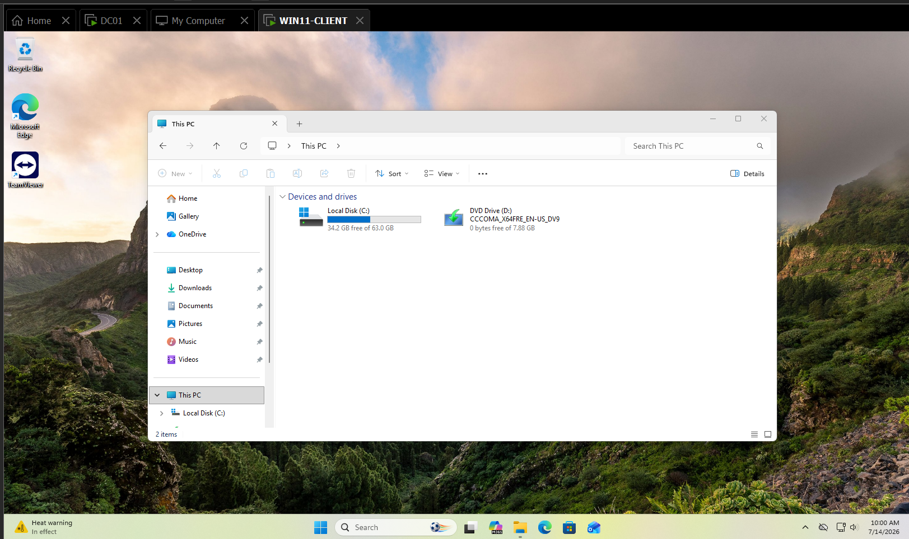
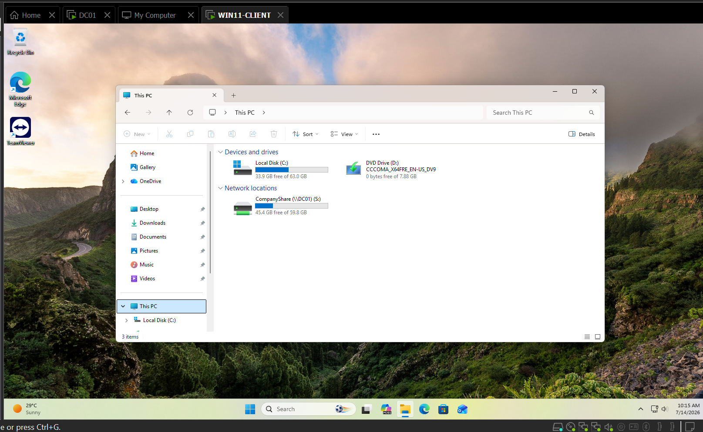

# TICKET-005 — jsmith Loses Access to Mapped S: Drive (Group Membership)

| Field | Detail |
|---|---|
| **Status** | Resolved |
| **Priority** | Medium |
| **Category** | Files & Permissions |
| **Affected System** | `WIN11-CLIENT (an employee's laptop I'm troubleshooting)` — mapped `S:` drive to `\\DC01\CompanyShare` |
| **Reporter** | jsmith (employee) |
| **Ticketing system** | Jira Service Management — [HIS-5](https://homelab-itsupport.atlassian.net/jira/servicedesk/projects/HIS/section/incidents/custom/10/HIS-5) |
| **Date Opened / Closed** | July 14, 2026 (same day) |

## Summary
Employee jsmith reported that the `S:` drive (mapped to
`\\DC01\CompanyShare`) was no longer visible in File Explorer, blocking
access to shared files. Diagnosed as a security group membership change:
jsmith had been removed from the `Staff` group that the drive-mapping
`GPO (Group Policy Object)` uses as its access condition.

## Symptoms
- The `S:` drive (`CompanyShare (\\DC01)`), previously present and
  working, no longer appears under Network locations in File Explorer.

## Environment Prep
The `CompanyShare` folder, `Staff` security group, and drive-mapping `GPO`
were built as part of setting up this scenario (see the shared-drive build
notes). While validating the "break" step, the `GPO`'s drive-map item was
found to be missing **"Remove this item when it is no longer applied"** —
a `Group Policy Preferences (GPP)` item that isn't enabled by default. By
design, `GPP` items don't tear themselves down when their targeting
condition stops matching; enabling this setting was required so removing
jsmith from `Staff` would actually simulate real access loss, rather than
leaving a stale drive mapping in place indefinitely.

## Diagnostic Steps
1. Checked jsmith's group membership in Active Directory Users and
   Computers (Member Of tab) — confirmed `Staff` was absent.
2. Confirmed this alone explains the missing drive: the `GPO`'s
   item-level targeting requires `Staff` membership, and share/`NTFS
   (NT File System)` permissions on `CompanyShare` were already verified
   working independently of group membership in `TICKET-004`.

## Root Cause
jsmith had been removed from the `Staff` security group, which the
`Drive Mapping - CompanyShare` `GPO` uses as its item-level targeting
condition. Once out of scope, the `GPO` no longer applies the mapping.

## Resolution
1. Re-added jsmith to the `Staff` security group in Active Directory
   Users and Computers.
2. Logged jsmith off and back on `WIN11-CLIENT` to refresh the security
   token and re-evaluate `GPO` scope.
3. Confirmed the `S:` drive (`CompanyShare`) reappeared under Network
   locations in File Explorer.

## Screenshots

*This PC on WIN11-CLIENT — no CompanyShare drive present under Network locations after jsmith was removed from Staff.*

*This PC on WIN11-CLIENT — CompanyShare (\\DC01) (S:) present again after restoring jsmith's Staff membership and a fresh logon.*

## Tools Used
`Active Directory Users and Computers`, `Group Policy Management`, File
Explorer, `Jira Service Management`.

## Time to Resolve
Same-day, under 30 minutes (excluding environment prep).
