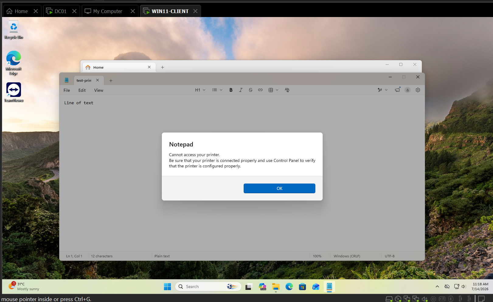
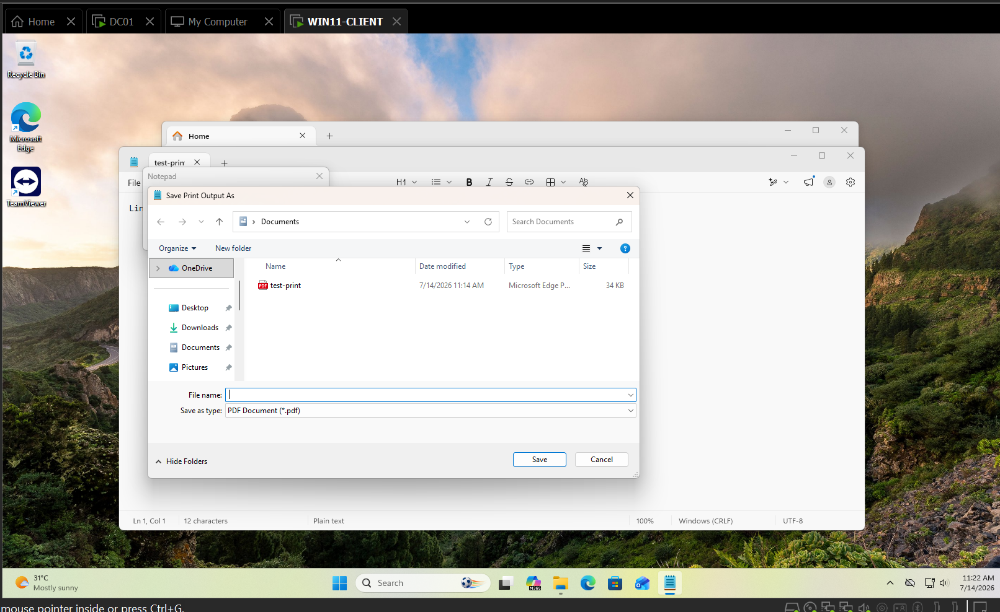

# TICKET-009 — jsmith Can't Print (Print Spooler Stopped)

| Field | Detail |
|---|---|
| **Status** | Resolved |
| **Priority** | Medium |
| **Category** | Print |
| **Affected System** | `WIN11-CLIENT (an employee's laptop I'm troubleshoot)` — Microsoft Print to PDF (virtual printer) |
| **Reporter** | jsmith (employee) |
| **Ticketing system** | Jira Service Management — [HIS-7](https://homelab-itsupport.atlassian.net/jira/servicedesk/projects/HIS/section/incidents/custom/10/HIS-7) |
| **Date Opened / Closed** | July 14, 2026 (same day) |

## Summary
Employee jsmith reported being unable to print — clicking Print produced
no output and no error. Diagnosed as the `Print Spooler` service being
stopped on `WIN11-CLIENT`, which prevented Windows from enumerating any
installed printers.

## Symptoms
- Attempting to print `test-print.txt` resulted in a dialog stating no
  printer was installed and prompting to install one — rather than a
  normal print job failure.
- No printers, including the built-in Microsoft Print to PDF virtual
  printer, were available to select.

## Environment Prep
No physical or network printer exists in the lab. Microsoft Print to PDF
(built into Windows 11) was used as the target printer, since it exercises
the same spooler/driver pipeline as a real printer for diagnostic
purposes. A working baseline print was confirmed before breaking the
scenario.

## Diagnostic Steps
1. Attempted to reproduce jsmith's reported symptom by printing
   `test-print.txt` — confirmed the "no printer installed" prompt.
2. Opened Services (`services.msc`) and located `Print Spooler`.
3. Checked Properties: **Service status** was Stopped, **Startup type**
   was Automatic — indicating an unexpected stop rather than a
   disabled/policy-blocked service.

## Resolution
1. Right-clicked `Print Spooler` in Services and selected **Start**.
2. Reopened `test-print.txt` in Notepad and printed to Microsoft Print to
   PDF.
3. Confirmed the print succeeded — the Save Print Output As dialog
   appeared normally, matching the pre-break working baseline.

**Root cause:** `Print Spooler` service stopped, so Windows could not
enumerate any printers.
**Fix:** Restarted the `Print Spooler` service.

## Screenshots

*Notepad reporting no printer installed after Print Spooler was stopped —
the actual symptom jsmith would have seen.*

*Successful print to Microsoft Print to PDF after restarting Print
Spooler, confirming the fix.*

## Tools Used
Services (`services.msc`), Notepad, Microsoft Print to PDF.

## Time to Resolve
Same-day, under 20 minutes.
