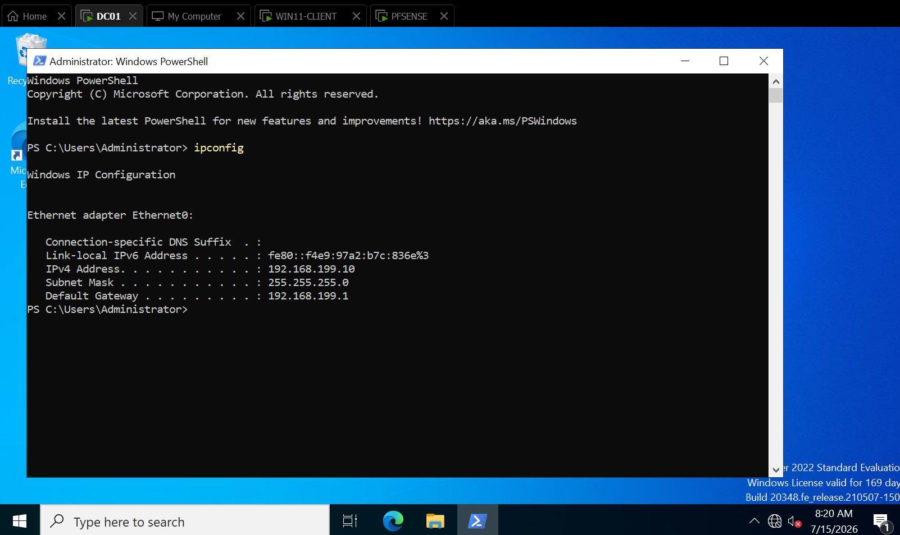
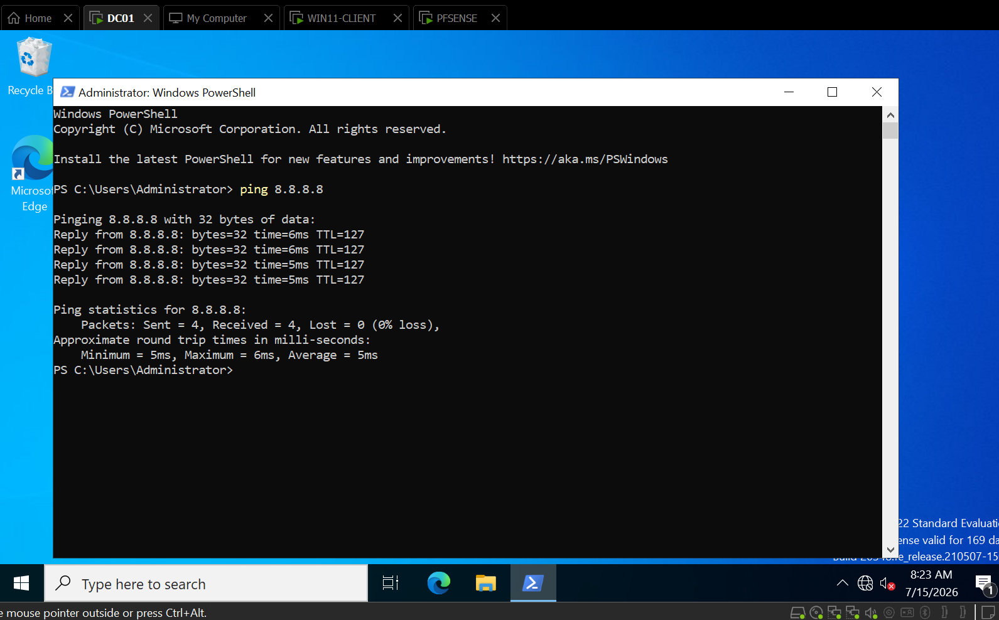

# TICKET-010 — DC01 Has No Internet After Default Gateway Cutover

| Field | Detail |
|---|---|
| **Status** | Resolved |
| **Priority** | High |
| **Category** | Networking / Routing |
| **Affected System** | `DC01 (the company's main server)` — Windows Server 2022, after routing was moved to go through `PFSENSE (the company's firewall / router / VPN gateway)` |
| **Reporter** | IT (self-generated during network change) |
| **Ticketing system** | Jira Service Management — HIS-8 |
| **Date Opened / Closed** | July 15, 2026 (same day) |

## Summary
After changing `DC01`'s default gateway to route through the newly built
`PFSENSE` firewall (`192.168.199.1`), `DC01` lost all internet
connectivity — `ping 8.8.8.8` and external `DNS (Domain Name System)`
resolution both failed — despite the gateway change appearing correct.
A peer client (`WIN11-CLIENT`) on the same subnet and same gateway worked
normally, isolating the fault to `DC01` itself. Two distinct client-side
causes were found and fixed: a competing second default gateway on a
secondary network adapter, and a stale `ARP (Address Resolution Protocol)`
cache entry for the gateway.

## Symptoms
- `ping 8.8.8.8` from `DC01`: 100% packet loss (request timed out).
- External name resolution failing.
- `WIN11-CLIENT (an employee's laptop I'm troubleshoot)` on the same
  subnet, using the same `192.168.199.1` gateway, had full internet —
  proving `PFSENSE` and the upstream path were healthy.

## Diagnostic Steps
1. Confirmed the fault was client-specific: a peer on the same subnet and
   gateway (`WIN11-CLIENT`) reached the internet fine, so `PFSENSE` and
   its `WAN (Wide Area Network)` path were ruled out.
2. Ran `ipconfig` on the affected clients to inspect adapter and gateway
   assignments. Found that a domain client carried **two active network
   adapters**, each with its own default gateway:
   - The `VMnet1` adapter (`192.168.199.x`) → gateway `192.168.199.1`
     (`PFSENSE`) — correct.
   - A second adapter (`192.168.154.x`) → gateway `192.168.154.2`
     (upstream `NAT (Network Address Translation)`) — competing.
   Windows was preferring the second gateway for outbound traffic, so
   traffic never reached `PFSENSE`.
3. Disabled the competing secondary adapter, which resolved connectivity
   on the affected client.
4. On `DC01` specifically, after confirming it had only a single correct
   adapter and gateway, `ping 192.168.199.1` (the gateway) still failed
   100% while `ping 192.168.199.50` (a same-subnet host) succeeded —
   reachability to one host on the subnet but not the gateway pointed to
   a stale `ARP` cache entry for the gateway's `MAC (Media Access
   Control)` address.

## Resolution
1. On any client carrying a competing second default gateway, disabled
   the secondary (`192.168.154.x` / `NAT`) adapter via Network
   Connections, leaving only the `VMnet1` adapter with gateway
   `192.168.199.1`.
2. On `DC01`, cleared the stale `ARP` cache with `arp -d *`.
3. Verified `ping 192.168.199.1` (gateway) — 0% loss.
4. Verified `ping 8.8.8.8` (internet via `PFSENSE`) — 0% loss.
5. Verified external `DNS` resolution: `nslookup google.com 127.0.0.1`
   (through `DC01`'s own `DNS` server via root hints) and
   `nslookup google.com 8.8.8.8` (raw outbound `DNS` through `PFSENSE`)
   both resolved successfully.

**Root causes:**
1. A competing default gateway on a second, still-enabled network adapter
   caused Windows to route outbound traffic away from `PFSENSE`.
2. A stale `ARP` cache entry on `DC01` for the gateway prevented gateway
   reachability even after the adapter issue was corrected.

**Fix:** Disabled the competing secondary adapter; flushed the `ARP`
cache on `DC01`.

## Note on DNS Tooling
An initial `nslookup google.com` with no server specified appeared to
fail, but this was a tooling artifact — `nslookup` defaulted to the IPv6
loopback (`::1`) as its server and timed out there. Explicitly targeting
`DC01`'s `DNS` server on IPv4 (`127.0.0.1`) and a public resolver
(`8.8.8.8`) both resolved correctly, confirming actual name resolution
was healthy.

## Screenshots

*`DC01` ipconfig showing a single adapter (`192.168.199.10`) with gateway
`192.168.199.1` — the clean post-fix state.*

*Successful `ping 8.8.8.8` from `DC01` through `PFSENSE` after the `ARP`
flush.*

## Tools Used
`ipconfig`, `ping`, `arp`, `nslookup`, pfSense diagnostics (Packet
Capture, States, Gateways), Windows Network Connections.

## Time to Resolve
Same-day.

## Key Takeaways
- When one client on a subnet works and another doesn't, the fault is
  client-side — check the failing client's adapters and routes before
  suspecting the gateway or firewall.
- A machine with multiple enabled adapters can carry multiple default
  gateways; Windows may prefer the wrong one and silently route traffic
  away from the intended path.
- Reachability to some subnet hosts but not the gateway is a classic
  stale-`ARP` signature; `arp -d *` clears it.
